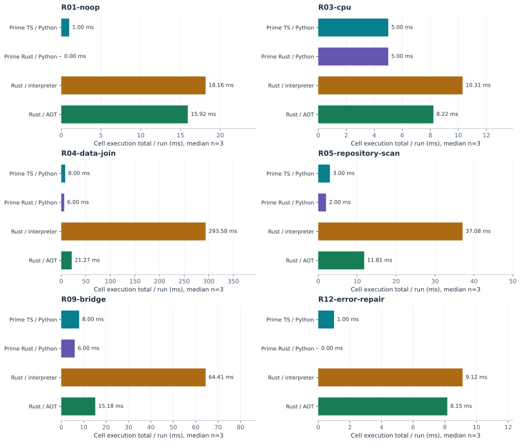
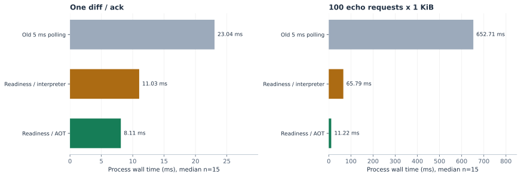
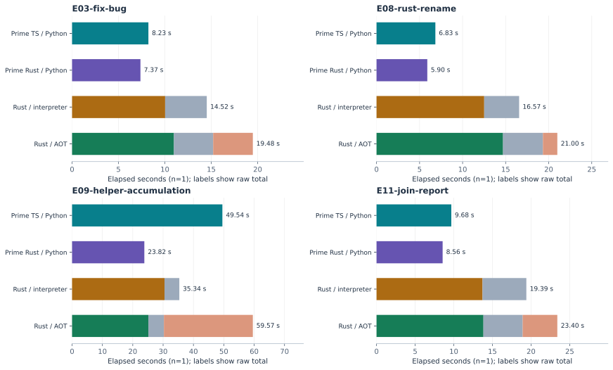
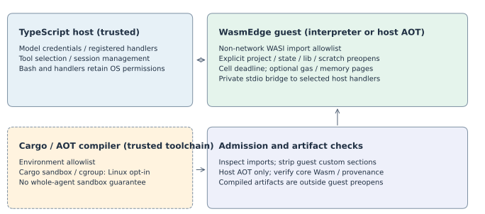

# Rust cell 安全性與效率統整報告

更新日期：2026-10-08。比較對象為 Prime Agent 的 TypeScript host／Python cell、Rust host／Python cell，以及 wasmedge-agent 的 Rust cell／WasmEdge interpreter 和 AOT。最新四組實驗與歷史診斷分開呈現。

**直接分享這個 HTML 檔案即可。** 結論、圖表、重要數據表與計時定義都在檔案內，可離線開啟；只有選讀的官方來源引用需要網路。

## 先看結論

| 讀者關心的問題 | 量測結論 | 實際意義 |
|---|---|---|
| 為何使用 Rust cell？ | 執行前編譯檢查、明確 guest 權限、可保存的來源與 state | 核心價值是可控、可檢查的執行單位；host 與 compiler 仍需各自限權 |
| AOT 有改善嗎？ | Data join：293.578 → 21.266 ms，**執行時間降低 92.8%** | 此固定工作量有效；AOT 編譯另列，完整任務仍包含該成本 |
| Bridge 改善有效嗎？ | 100 次 echo：652.714 → 65.795 ms，**process 時間降低 89.9%** | Readiness 消除 polling 等待；加入 AOT 再降至 11.224 ms |
| 這輪 Rust 比 Python 快嗎？ | 六個固定案例的 Rust／AOT cell 合計仍高於兩個常駐 Python kernel | 短 cell 仍負擔新 process／VM；本矩陣沒有 Rust 普遍勝出的證據 |
| 證據範圍多大？ | **固定程式 72/72、任務 16/16、安全測試 65 項通過** | 固定 n=3、任務 n=1；14 項 Linux 測試略過，是本機結果而非全面效能排名 |

## 1. 效率的固定程式對照

最新固定程式測試為 6 cases × 4 variants × 3 repetitions。兩個 Wasm 模式使用完全相同的 Rust reference sources，Python 使用等義操作與共同輸出契約。這一層排除模型生成差異，適合判讀 runtime 原因；不是不同語言產生完全相同機器指令的對照。

以下是每 run 的 cell 執行時間合計，再取 3 次 run 的 median，單位 ms。**排除 Cargo／AOT compilation、初始化與 snapshot；Rust 執行仍包含新 process、module／VM、guest、bridge 和 output drain。** Python 為常駐 kernel 回報，0 ms 代表低於整數毫秒解析度。R01／R04 各有兩個 cells。

| 案例 | Prime TS / Python | Prime Rust / Python | Rust / interpreter | Rust / AOT |
| --- | --- | --- | --- | --- |
| R01-noop | 1.000 | 0.000 | 18.162 | 15.922 |
| R03-cpu | 5.000 | 5.000 | 10.306 | 8.224 |
| R04-data-join | 8.000 | 6.000 | 293.578 | 21.266 |
| R05-repository-scan | 3.000 | 2.000 | 37.079 | 11.805 |
| R09-bridge | 8.000 | 6.000 | 64.415 | 15.182 |
| R12-error-repair | 1.000 | 0.000 | 9.120 | 8.154 |

固定程式的 data join 從 interpreter 293.578 ms 降至 AOT 21.266 ms，執行成本約降低 92.8%；repository scan 與 bridge 也改善。短 CPU cell 的 AOT 8.224 ms 仍高於兩個 Python kernel 的 5.000 ms；每個 cell 啟動新的 process／VM 是重要固定成本。這支持按 workload 選 execution mode，沒有支持「Rust 編譯後就一定比較快」。

先前固定診斷也確認 Python JSON 走 `_json` C accelerator，而 Rust `serde_json` 在 interpreter 中逐指令執行。近空程式的 process wall time 約 8–10 ms；guest 計算本身可以很短，但整個 cell 仍受 launch／load 等成本影響。原慢因分析保存 CPU／JSON／regex／state 的 body timers；其中 AOT／1 ms polling 是修正前的診斷控制，最新產品狀態以本報告和實作分析為準。

## 2. Bridge 改善的因果對照

使用相同的 `diff.rs`／`bridge.rs` source bytes、同一 host handlers 與 1 KiB payload。舊 polling、新 readiness interpreter、新 readiness AOT 輪替執行；每模式／案例 2 warmups + 15 measured samples，總計 102 個樣本全部保存。下圖與表只採 measured samples 的 median。

| 工作 | 舊 polling ms | Readiness interpreter ms | Readiness AOT ms |
| --- | --- | --- | --- |
| 一次 diff／ack | 23.041 | 11.030 | 8.106 |
| 100 echo × 1 KiB | 652.714 | 65.795 | 11.224 |

100 次 echo 的 process 執行時間從 652.714 ms 降至 65.795 ms，readiness 修正降低約 89.9%。正常 WASI reply reads 改以 `poll_oneoff` 同時等待 stdin 就緒與 monotonic deadline，資料抵達即可讀取；native TCP 與罕見 write retries 仍保留既有 polling。

AOT 再降至 11.224 ms。只看 guest body，100 次 echo 為 639.344 → 53.548 → 3.207 ms，支持 readiness 去除等待後，interpreter／JSON framing 等工作仍有優化空間。此次對照不與較早排程環境不同的 bridge median 混算。

上述 AOT 執行前另花約 2.74／2.76 秒編譯。若未來可信 artifact 可以重用，在此固定 100-echo workload 下，以 2.76 秒除以每次約 54.57 ms 的執行節省，約需 **51 次**才回收一次 AOT 編譯成本。這是固定程式與未來重用前提下的算術估算；目前每 cell 重編，沒有這個 amortization 收益。

## 3. Opus 5.5 的完整任務結果

4 tasks × 4 variants × 1 repetition，16/16 通過共同 checker 與逐回合 cell 契約，共 70 次付費模型 requests。Route 為 `anthropic/claude-opus-5-5`，reasoning off；服務 advertised model ID 已保存，不可變 backend revision 未獨立驗證。

每個模型回合至少一次成功的 Python／Rust cell；讀檔、計算、修改與寫檔在 cell 完成。實際 sources／library edits 已逐份檢視，沒有 shell／subprocess 代做。Node／Cargo 等共同驗收在 agent 完成後執行、另計時間。這不同於產品允許 native command tools 的任務迴圈。

### 原始 agent 時間

單位秒，包含 workspace 初始化、模型 requests、工具執行與生成程式的修錯；排除 daemon 啟動與 agent 完成後的 checker。每格只有一次實測。

| 任務 | Prime TS / Python | Prime Rust / Python | Rust / interpreter | Rust / AOT |
| --- | --- | --- | --- | --- |
| E-03-fix-bug | 8.227 | 7.370 | 14.517 | 19.481 |
| E-08-rust-rename | 6.834 | 5.897 | 16.565 | 21.003 |
| E-09-helper-accumulation | 49.535 | 23.817 | 35.342 | 59.570 |
| E-11-join-report | 9.678 | 8.556 | 19.391 | 23.400 |

### 全部 Cargo 與 AOT 分開扣除

以下同樣使用 **agent 期間**，單位秒。Cargo 包含此期間內所有 runtime-managed Cargo 命令，包括初始化、library gates、失敗重試；`cargo test` 整段 wall time 含測試，並非純 compiler CPU。AOT 是 WasmEdge compiler 的命令 wall time。重疊取區間聯集、裁切於 agent 期間；期外 checker 不從 agent elapsed 扣除。

| 任務 | Rust runtime | 原始 agent | 全部 Cargo | AOT | 扣除兩者後 |
| --- | --- | --- | --- | --- | --- |
| E-03-fix-bug | Rust / interpreter | 14.517 | 4.486 | 0.000 | 10.031 |
| E-03-fix-bug | Rust / AOT | 19.481 | 4.226 | 4.277 | 10.979 |
| E-08-rust-rename | Rust / interpreter | 16.565 | 4.056 | 0.000 | 12.510 |
| E-08-rust-rename | Rust / AOT | 21.003 | 4.630 | 1.675 | 14.697 |
| E-09-helper-accumulation | Rust / interpreter | 35.342 | 4.882 | 0.000 | 30.460 |
| E-09-helper-accumulation | Rust / AOT | 59.570 | 5.122 | 29.310 | 25.138 |
| E-11-join-report | Rust / interpreter | 19.391 | 5.673 | 0.000 | 13.718 |
| E-11-join-report | Rust / AOT | 23.400 | 5.075 | 4.488 | 13.837 |

Python 四個 agent 期間的 Cargo／AOT 扣除量均為 0，扣除後等於上表；E08 的共同 checker Cargo 只在含驗收期間扣除。圖形報表另可切換「全部 Cargo」及「全部 Cargo + AOT」，並可選 agent／user／初始化到驗收完成的時間邊界。扣除是對同一筆量測做算術分解，沒有把程序真的免編譯重跑。

E09 AOT 的 3 次 regex compilation 合計 **29.31 秒**，造成原始 agent 時間 59.57 秒；扣除全部 Cargo + AOT 後約 25.14 秒，interpreter 約 30.46 秒。這只說明本輪分段：生成 sources／cell 次數不同，不能用扣除後的大小當純 runtime speed ratio。

### Cell 執行與修錯成本

<!-- paid-cell-chart -->

| 任務 | 版本 | 成功／runtime 失敗／Cargo 失敗 | Cell 執行合計 ms |
| --- | --- | --- | --- |
| E-03-fix-bug | Prime TS / Python | 2/0/0 | 4.000 |
| E-03-fix-bug | Prime Rust / Python | 2/0/0 | 1.000 |
| E-03-fix-bug | Rust / interpreter | 2/0/0 | 21.529 |
| E-03-fix-bug | Rust / AOT | 2/0/0 | 17.443 |
| E-08-rust-rename | Prime TS / Python | 1/0/0 | 3.000 |
| E-08-rust-rename | Prime Rust / Python | 1/0/0 | 2.000 |
| E-08-rust-rename | Rust / interpreter | 1/0/1 | 10.758 |
| E-08-rust-rename | Rust / AOT | 1/0/1 | 9.421 |
| E-09-helper-accumulation | Prime TS / Python | 6/5/0 | 24.000 |
| E-09-helper-accumulation | Prime Rust / Python | 4/1/0 | 3.000 |
| E-09-helper-accumulation | Rust / interpreter | 4/0/1 | 83.375 |
| E-09-helper-accumulation | Rust / AOT | 3/0/0 | 33.263 |
| E-11-join-report | Prime TS / Python | 2/0/0 | 5.000 |
| E-11-join-report | Prime Rust / Python | 2/0/0 | 3.000 |
| E-11-join-report | Rust / interpreter | 2/0/0 | 22.356 |
| E-11-join-report | Rust / AOT | 2/0/0 | 18.846 |

成功／runtime 失敗／Cargo 失敗欄為 cell 次數；所有 AOT compiler failure 均為 0。合計 46 cells，6 次 runtime errors、3 次 Cargo compile errors，均在成功 trajectory 中修復，成本完整保留。E09 的 Prime TS、Prime Rust、interpreter、AOT 分別呼叫 11、5、5、3 次 cells；Python resident imports/cache 與 Rust 新 process 的狀態行為也不同。可維護 helpers 的價值已有實際 trajectory，但目前無跨任務長期 token／金錢節省的量測。

### 模型 requests 與 token 用量

以下合計同一輪四個任務的所有模型 requests，包括修錯與後續回合。Prompt tokens 含 cached tokens；cached 欄是其中的子集，不重複相加。這是產品 trajectory 的用量，不是固定程式 runtime 指標。

| 版本 | Requests | Prompt tokens | 其中 cached | Output tokens |
| --- | --- | --- | --- | --- |
| Prime TS / Python | 22 | 309,260 | 237,307 | 4,327 |
| Prime Rust / Python | 16 | 264,457 | 194,803 | 2,709 |
| Rust / interpreter | 17 | 177,375 | 134,027 | 4,190 |
| Rust / AOT | 15 | 151,682 | 108,740 | 3,612 |

本輪 Rust／AOT 比 interpreter 少 2 次 requests、578 個 output tokens；模型生成程式與修錯路徑不同，沒有證明 AOT 會讓模型固定減少 tokens。Rust cell 的 output 用量也沒有一致低於兩個 Python 版本。服務未提供本輪完整帳務明細，沒有用 token 數推算實際付費金額。

## 4. 核心價值與證據

| 價值 | 目前可支持的主張 | 證據與適用條件 |
|---|---|---|
| 限制模型程式的能力 | Guest 只能使用允許的 WASI imports 與明確 preopens；直接 socket imports 在執行前被拒絕 | Interpreter／AOT 真實 WasmEdge 測試都驗證了 `sock_open` 拒絕；host handlers 的能力另由 host 決定 |
| 縮小憑證暴露面 | Guest 只接收 host 選擇的環境；Cargo／AOT compiler 不繼承未列入 allowlist 的環境變數 | Environment allowlist 與 AOT compiler tests；未啟用 Cargo sandbox 時仍可能讀取 host 檔案或 Cargo config |
| 控制失控執行 | 可限制 guest gas、linear memory pages 與 cell deadline；錯誤設定不降級執行 | Interpreter／AOT 的 gas exhaustion 與 memory growth 負向測試；gas／page caps 需設定，並非全流程 RSS 限制 |
| 提早發現程式錯誤 | Rust 型別、借用與 ownership 檢查在 guest 執行前進行；失敗 build 不執行新 cell | Compiler diagnostics、來源回復與實際付費修錯紀錄；不保證業務邏輯正確，也可能增加修錯 round trips |
| 累積可維護的能力 | Helpers 以 `agent_lib` 原始碼保存，state 顯式落盤，成功 cells 有 workspace Git snapshots | Workspace／library gate／snapshot 實作；沒有任意 in-memory namespace、交易式副作用回滾或位元級 deterministic replay 保證 |
| 降低特定執行成本 | AOT 降低 interpreter 的 JSON／regex 等執行成本，readiness bridge 降低固定 polling 等待 | 固定程式四組對照與 bridge 前後交錯量測；必須另計 Cargo、AOT 與新 process 成本 |

可對外表達的主張是：**Rust cell 提供可檢查、可限權、可保存的執行單位；WasmEdge AOT 為運算較重的程式提供效率改善的路徑，bridge readiness 已降低互動成本。** 目前實測不支持把所有任務概括為比 Python 更快、更省記憶體或更省模型費用。

## 5. 安全性提升的範圍

### 預設控制與可選控制

| 控制 | 預設或啟用方式 | 可限制的範圍 | 驗證與限制 |
|---|---|---|---|
| 非網路 WASI import allowlist | 預設 | Guest 的直接 socket、plugin、未知 module imports | Imports 檢查只驗證、不在 Node host instantiate guest；拒絕在 guest 執行前發生 |
| 明確檔案 preopens | 預設 | `/workspace`、`/agent/state`、`/agent/lib`、`/scratch` | `/workspace` 預設可寫；guest library mount 唯讀，來源編輯經 host tool 的 `lib` 參數 |
| Project 唯讀 | `workspaceWritePolicy: "ro"` | Guest 對 project 的寫入、刪除、改名等 | 真實 WasmEdge 負向測試；mount overlap／symlink／colon ambiguity 檢查防止可寫別名；host handlers 不受此 guest mount 限制 |
| Host stores 隔離 | 預設 mount 檢查 | Writable preopens 與 harness stores 的路徑重疊 | 檢查既存 ancestors 與 symlinks；不涵蓋任意 host hard links／並行 filesystem races |
| Compiler environment allowlist | 預設 | Parent ambient credentials／flags／wrappers 的一般繼承 | 不等於 compiler filesystem 沙箱；既有 sources/artifacts 不清除過去的資料 |
| Cell timeout | Runner cell budget | 編譯、AOT、執行與 bridge 的該次 cell 流程 | Runner queue、workspace provisioning 不在該 cell deadline；host handler 已產生的副作用不自動撤回 |
| Guest gas 與 memory pages | `cellGasLimit`／`cellMemoryPageLimit` | Guest 指令成本與每個 linear memory 的頁數 | AOT 以 `--interruptible` 與必要 gas instrumentation 產生；不是 compiler／host／整棵 agent tree 的總額 |
| Cargo process sandbox | Linux `cargoSandbox: "bubblewrap"`；預設 off | Build scripts／proc macros／`include_str!` 可見 filesystem 與編譯網路 | 不可用時 fail closed；macOS 本輪未啟用；host-managed vendoring 有獨立網路政策 |
| Invocation／tree 資源限制 | Linux `processLimits`／`treeProcessLimits`；預設 off | Cargo／WasmEdge descendants 的 charged memory、CPU bandwidth、processes／threads | cgroup v2／systemd／Bubblewrap 前提；不含 Node host、bash、host handlers，沒有 disk quota |
| 可信 AOT artifact | `runtimeMode: "aot"`；預設 interpreter | Guest 自帶 native payload 繞過 Wasm inspection 的路徑 | 先檢查 imports，剝除 guest custom sections，host 重新編譯；核對 core Wasm 與 native payload、保留 SHA256 provenance；沒有 AOT cache |

兩個 pinned Prime Agent README 都明確說明 Python 與 project commands 以使用者權限執行，worker／kernel 分離是生命週期隔離，並非安全沙箱。對照的 kernel startup 也會複製 parent environment。這是本實驗固定 revision 的差異；Python 同樣可以另外配置外部 sandbox，沒有宣稱所有 Python 架構都無法限權。

Rust ownership 檢查能在編譯階段排除一類錯誤；這是 [Rust 官方文件](https://doc.rust-lang.org/book/ch04-01-what-is-ownership.html) 描述的語言特性。Python 本身也有記憶體管理，不能用「Python 沒有記憶體安全」作比較。Host 存取權限的差異主要來自 Wasm／WASI 能力配置與 runner 政策，[WASI 官方定位](https://wasi.dev/)也強調 capability-based security；Rust 語言本身不提供 OS 沙箱。Unsafe code、native dependencies、compiler、runtime、host handlers 仍須納入信任邊界。

### 已重驗的安全性證據

| 測試檔 | 通過 | 平台條件略過 |
| --- | --- | --- |
| rust-cell-aot.test.ts | 5 | 0 |
| rust-cell-bridge-integration.test.ts | 4 | 0 |
| rust-cell-cargo-environment.test.ts | 2 | 0 |
| rust-cell-cargo-sandbox.test.ts | 3 | 7 |
| rust-cell-harness-mounts.test.ts | 4 | 0 |
| rust-cell-process-limits.test.ts | 3 | 7 |
| rust-cell-resource-limits.test.ts | 11 | 0 |
| rust-cell-wasm-imports.test.ts | 16 | 0 |
| rust-cell-workspace-policy.test.ts | 17 | 0 |
| 合計 | 65 | 14 |

這輪在 macOS 使用真實 WasmEdge 執行：interpreter／AOT 的禁止 socket import、gas 耗盡、memory growth 限制、large UTF-8 bridge 與 timeout 後 fresh handshake 均通過；project 唯讀測試使用 interpreter。Environment、import allowlist、mount aliases、AOT stripping／provenance／fail-closed 另有 unit tests。Linux Bubblewrap／cgroup 的真實測試因平台前提略過，不能把 macOS 結果當成 Linux enforcement 實證。完整設定與未涵蓋的 host 路徑見 runtime trust boundary。

## 6. 比較的四組架構

| 組別 | Host | Cell 與 runtime | 固定 revision |
| --- | --- | --- | --- |
| Prime TS / Python | TypeScript | Python resident kernel | `7d442aafa985` |
| Prime Rust / Python | Rust | Python resident kernel | `967eb13fd488` |
| Rust / interpreter | TypeScript | Rust / WasmEdge interpreter | `48d6312570f7` + runtime patch |
| Rust / AOT | TypeScript | Rust / WasmEdge AOT | `48d6312570f7` + runtime patch |

Prime Agent 的 Rust 版本改寫的是 host，cell 仍為 Python。wasmedge-agent 目前仍使用 TypeScript host；本實驗的 runtime 差異是 Python kernel 與 Rust／Wasm cell。最新 interpreter 與 AOT 兩組共用同一份 fork source/build 和更新後的 bridge，只有 runtime mode 不同。

Python 重用常駐 kernel 與記憶體；Rust 每個 cell 是一個完整程式，啟動新的 WasmEdge process／VM。跨 cell 的 helpers、state 與 project files 由磁碟保存。這使持久內容更明確，也意味著大型資料、JSON 和 regex 可能每 cell 重新載入或建立。

## 7. 為何 Rust cell 原先較慢

| 機制 | 已確認的證據 | 已處理或仍存在的成本 |
|---|---|---|
| 新 session 的初始化 Cargo | 前次正式 provisioner 診斷：無 skill 約 0.35–0.39 s；加入 websearch skill 約 4.61–5.05 s，主要為 probe build | 全部 Cargo ledger 現在納入；仍有實際初始化成本，沒有在此宣稱已消除 |
| 每 cell 新 WasmEdge process | 近空程式診斷及最新 R01 成功 cell 平均約 8 ms | AOT 保留 process／VM 成本；embedded runner／reuse 尚未完成 |
| Interpreter 的 JSON／regex 工作 | 同 artifact AOT 控制與最新固定程式 join 大幅改善 | 已新增可信 host AOT；編譯另計，interpreter 保留 |
| Bridge 固定 5 ms polling | 同程式前後交錯量測、guest body 等待降低 | 正常 WASI reply read 已改 readiness + deadline |
| 每 cell 重新建立資料／regex | E09 source 與 body timers；state 為檔案存取，沒有走 bridge | 顯式 state 可保存預處理結果；常駐資料服務／跨 cell compiled regex cache 尚未實作 |
| 模型輸出與修錯 trajectory | 前次 E11 Rust 輸出 tokens 更多；最新 E08 Cargo failures 與 E09 cell 次數不同 | 屬產品效率的一部分，需保留 request／diagnostics／失敗成本，不能全歸因給 Wasm |

### 先前控制實驗：guest 工作與完整 cell 的差距

以下是 readiness 更新前的診斷；每組 2 次 warmup 後量測 15 次取 median，interpreter／AOT 使用同 artifact。Body timer 在 guest 內，不含啟動／載入；不與最新六案例矩陣混算。

| 固定工作 | Interpreter cell ms | AOT cell ms | Interpreter body ms | AOT body ms |
|---|---|---|---|---|
| 近空程式 | 8.361 | 7.026 | 未設 body timer | 未設 body timer |
| 100,000 次 CPU 運算 | 10.690 | 6.616 | 2.022 | 0.023 |
| 10,000 筆 JSON parse | 223.773 | 9.009 | 211.703 | 1.220 |
| Regex 與保存的 state | 31.237 | 10.308 | Regex 4.574；match 3.484 | Regex 0.161；match 0.048 |

對應 AOT compiler 命令另花 1.407、1.505、1.822、10.810 秒，未包含於 cell 欄。Guest 計算變快不會消除 process／VM 固定成本。Python JSON 使用原生 `_json` accelerator；Rust JSON 在 Wasm 執行，library 路徑不同。

## 8. 細分計時與資料解讀

| 問題 | 已量測的邊界 | 解讀 |
|---|---|---|
| Write code 花多久 | `llm.tool_arguments_generation`、`llm.code_emission`、`llm.code_ready` 與保存的 SSE／cell sources | Source tool arguments 從 wire stream 出現至完成的可觀測區間；不等於服務端純生成時間或模型思考時間 |
| 寫入 Rust source／準備 mount | `cell.source_prepare`／runner `prepareMs` | 包含來源與 mount/state 準備；沒有單獨 isolate write syscall 時間 |
| 初始化／provisioning | `host.daemon_startup`、`cell.provision`、各期間邊界和全部 Cargo ledger | 必須保留在實際使用時間；不與嵌套 Cargo 重複相加 |
| Rust → Wasm | `cargo.command`、主 cell `cell.compile`／`cargoMs` | 全部 Cargo 命令有 ID、argv、cwd、起訖、outcome 與 clock calibration；typecheck／codegen／link 未完整拆分 |
| Wasm → AOT | `aot.command` 與 `cell.aot_compile`／`aotCompileMs` | 命令計時與 host strip／verification 外層 phase 不相加；後者還含 wrapper 啟動等外層工作 |
| Runtime 執行 | Python `cell.python_execute`、Rust `cell.execution` | Rust 包含 launch／load／VM／guest／bridge／I/O；paid cells 沒有完整 guest body partition |
| Cleanup／持久化 | `cell.bridge_cleanup`、`cell.snapshot`、`cell.other` | 成功 snapshot 的時間和失敗 attempts 均保留；Git 失敗不重執行已成功的 cell |
| 完整任務 | `task.agent_elapsed`、`run.user_elapsed`、`run.validated_elapsed`、`task.check` | Agent 排除 daemon／checker；user 包含 daemon 到 agent 完成；validated 包含初始化到共同 checker 完成 |
| 資源效率 | Schema 預留 CPU user/system、peak tree RSS；此輪沒有完整資料 | 沒有宣稱 Rust memory／energy 優勢；Wasm memory cap 與實際 RSS 節省是不同問題 |

Cell 圖的「每 run 合計」包含成功與 runtime 失敗的執行；Cargo／AOT 失敗不算 runtime。成功 cell 平均先逐 run 算，再取 median；cell 合計是工作量，平行時不是任務 wall time。

顯示語意統一：**「完整量測、扣除量 0」**表示 ledger 完整且該期間沒有 compiler 命令；**「此版本沒有 AOT 階段」**表示不適用；**「無法計算」**表示資料不足；**「未納入比較」**表示未通過驗收／cell 契約。沒有把缺失回填為 0。Python 0 ms execution 表示解析度不足，並非零成本。

## 9. 實驗環境與證據沿革

環境為 Darwin 25.6.0 arm64、Apple M5 Max、18 logical CPUs、128 GiB RAM、Node 24.13.1、Cargo／rustc 1.98.1、WasmEdge 0.14.1；Rust host、adapter、guest 採 release。最新 fork baseline 為 `48d6312570f7d39809703db2c69a43f342fb7424` 加保存的未提交 runtime source patch，不能只用 commit ID 重建；prepared inputs／launcher／template／collector hashes 與原始成果均保存。

歷史 campaigns 包含 host replay、native tools 與不同 Cargo capture 規則，完整結果本機保存，未併入最新比較。

舊 host/replay、native-tool policy、runtime-only、完整 Cargo capture 和最新 AOT campaigns 各有不同控制，不混成總平均。首次 runtime campaign 的 bridge adapter 與 native-command adapter 失敗仍保存；最新固定程式矩陣通過的是列出的 6 cases，不是全部設計中的 16 cases。2026-08 的可行性研究、舊 12-task benchmark和 2026-10-07 microbenchmark為歷史背景，runtime／模型／環境不同，不併入此次速度結論。

最新兩個 campaigns 共 5422 spans，schema／integrity 檢查皆無錯誤；Cargo 86 條、AOT 32 條命令 capture 完整。每次 paid response、生成程式、修錯、session、project outputs、checker、失敗 attempts 都保留。先前實際 key 掃描的已檢文字檔案沒有外洩；這是保存成果的指定掃描範圍，不是全系統秘密偵測。

固定程式每組 n=3，付費任務每組 n=1；沒有 confidence intervals、跨平台複驗或完整 instrumentation overhead audit。結果足以說明本機 workload 的成本與修正效果，尚不足以估計跨任務穩定勝率。模型 ID 也不等於獨立驗證的 backend revision。

## 10. 採用與下一步

**適合優先採用 Rust cell 的情境**是需要明確 guest 能力邊界、受控資料存取、可檢查的型別化 helpers，以及可保存、可 review 的長期程式資產。需要更強 compiler／tree 隔離時，應在符合前提的 Linux 啟用相應 controls，再以負向測試驗證部署設定。任務是否受隔離仍取決於工具和 host handlers 的權限。

**效率選擇應按工作量決定。** 短小且程式常變的 cells，interpreter 避免額外 AOT 成本；JSON／regex／bridge 密集的 cells，AOT 已降低執行時間，但目前每 cell 重編，必須把 compiler 費用放回實際總時間。較少的 cells、批次處理和顯式預處理 state 是現有 API 可採的方式，尚未量測其普遍節省。

| 下一步 | 預期改善 | 驗收方法 |
|---|---|---|
| 按 inspected Wasm／compiler／flags／platform 識別的可信 AOT cache | 相同程式的編譯攤提 | Cache hit／miss 分開、失效與污染負向測試，重用時仍符合 import／resource policy |
| Embedded runner／減少 process 固定成本 | no-op／短 cell latency | 每 cell 保持新的 instance／能力邊界；量 launch、load、guest、cleanup，而非只看 guest timer |
| Template／skill probe cache 與初始化並行 | 新 session 首次請求 latency | 保留來源／toolchain 變動失效，分 cold／warm／resume；避免阻塞 Node event loop |
| 更大、重複且配對的 Opus 任務矩陣 | 可對外泛化的速度／成功率／token 成本 | 預先固定 tasks／budgets／樣本規則，保留 failures、CI，先審核量測 overhead |
| 安全性攻擊矩陣 | 防護完整性的比較 | 非 preopen／symlink／compiler／credentials／gas／AOT payload／bridge 方法逐項測試；Python 另列是否有外部 sandbox |
| CPU／RSS／memory 指標 | 效率主張的資源面 | 將 compiler、WasmEdge、host handlers 與 tree 邊界分開；實際資源使用與配置上限分開報告 |

## 證據識別與重建

讀者作決策需要的數據已整合於上文：六案例 runtime、bridge 控制、完整任務、全部 Cargo／AOT 扣除、cell 失敗、模型用量、安全測試與計時定義。原始 traces、生成程式及歷史 dashboards 本機保存，閱讀本報告不需要它們。

下列來源 SHA-256 用於識別保存的證據；hash 本身不是可重現套件。重跑實驗需要 baseline 與 runtime patch。重建閱讀版只使用 Git 中的精簡 aggregate、模板與 SVG，不重跑 benchmark、不呼叫模型。

`uv run --with markdown==3.10.2 python poc/bench/consolidated-report.py` 產生中英文單檔 HTML。只有原始本機證據仍在時才使用 `--refresh-evidence`，另需 Matplotlib 3.10.8；該選項稽核既有資料，不發出模型請求。

保存證據的來源 SHA-256

<table><thead><tr><th>Source</th><th>SHA-256</th></tr></thead><tbody><tr><td><code>packages/coding-agent/test/rust-cell-aot.test.ts</code></td><td><code>8290ed6c37aa7a469d3932a6b402fe07bd86a97f40031b5b470a0c04fea4d670</code></td></tr><tr><td><code>packages/coding-agent/test/rust-cell-bridge-integration.test.ts</code></td><td><code>b45b39be3b57b264739e3041afc392b45fc398b7eb5e2dee3a0d8b1c88e80528</code></td></tr><tr><td><code>packages/coding-agent/test/rust-cell-cargo-environment.test.ts</code></td><td><code>73d41dcab73b2894a2b19ebe7c2156f4a9e014aaeba39a4bbf33b9408c0362ec</code></td></tr><tr><td><code>packages/coding-agent/test/rust-cell-cargo-sandbox.test.ts</code></td><td><code>387e492f23025fc3c4cc932fd6b3557016fd9c4c0c9cb53f1509e7a177ba5679</code></td></tr><tr><td><code>packages/coding-agent/test/rust-cell-harness-mounts.test.ts</code></td><td><code>226f528a773a0878c784e3d11d88bee8240ad521a36c55f7b7c0efecc40e93fd</code></td></tr><tr><td><code>packages/coding-agent/test/rust-cell-process-limits.test.ts</code></td><td><code>357d8ae9ce59237e38dd5698c90c66c8b94e3fdd64dbb64d98e8a3fe488abbea</code></td></tr><tr><td><code>packages/coding-agent/test/rust-cell-resource-limits.test.ts</code></td><td><code>07abf0ea1fe25f528be78eac78de227aac27ca67fd0d88de83d67ce3d3dd7154</code></td></tr><tr><td><code>packages/coding-agent/test/rust-cell-wasm-imports.test.ts</code></td><td><code>ac2828b2e25ace4ee2e20d02815cc26b3f8ec06d1cfe30c348d62f4c0cffa2dd</code></td></tr><tr><td><code>packages/coding-agent/test/rust-cell-workspace-policy.test.ts</code></td><td><code>172670770d05257739d21a0f50510f2ea9b25e7ca0f9f2a983784c0b9d5c21c7</code></td></tr><tr><td><code>poc/bench/consolidated-report.py</code></td><td><code>c30ba67d887eb59f0b6bf6aad8606f4a33624cea1fdb8e892f2fe2fc94a36ff8</code></td></tr><tr><td><code>poc/bench/results/bridge-readiness-diagnostic-20261008-01/summary.json</code></td><td><code>50f6cb67cd43c026f7a316b4ee038d0132d19b7d022d9863b5206e726d49cca9</code></td></tr><tr><td><code>poc/bench/results/consolidated-report-20261008-01/security-validation.json</code></td><td><code>a37a81c693af3197dfdc40f93374cad6d0160ff210c9d4673a9ac8df485b3a89</code></td></tr><tr><td><code>poc/bench/results/four-way-aot-bridge-runtime-01/report-provenance.json</code></td><td><code>ec552643f5c9f7807810dd78d87151e77b9594b32ec33dc7a27b2cbd9935694d</code></td></tr><tr><td><code>poc/bench/results/four-way-aot-bridge-runtime-01/report.html</code></td><td><code>527c9a20c2ea25277defc263789ebcccfe9362a830f1d54814f7b64b901f211b</code></td></tr><tr><td><code>poc/bench/results/four-way-aot-bridge-runtime-01/report.json</code></td><td><code>2b16c3fab6b481c432246d890be7ad77a8011d02235b03ec8496046ef7d32288</code></td></tr><tr><td><code>poc/bench/results/four-way-aot-bridge-runtime-01/runs/R01-noop-prime-rust-r1-5612fe53-8783-4fcd-bcc7-4b851de6b9c0/spans.jsonl</code></td><td><code>408106eba82f27463ec01c122f95f2869b873f427ab14b373cd7f6d85d28bfbd</code></td></tr><tr><td><code>poc/bench/results/four-way-aot-bridge-runtime-01/runs/R01-noop-prime-rust-r2-2dbbf5cf-001e-4ea2-b206-6ce91ff65ffc/spans.jsonl</code></td><td><code>2a2f29e692d4178e7d43bbefdd6e147bbf5b85bb901b673421dddd1fddeda102</code></td></tr><tr><td><code>poc/bench/results/four-way-aot-bridge-runtime-01/runs/R01-noop-prime-rust-r3-f3e0774d-a136-4e2d-b8fb-7b4efc9da9df/spans.jsonl</code></td><td><code>0d7a9966752d4cb0fcc41a2d927a6470e6750b4bb465c6d1320109db5459f391</code></td></tr><tr><td><code>poc/bench/results/four-way-aot-bridge-runtime-01/runs/R01-noop-prime-ts-r1-d9cb3d80-3e99-490f-b46b-5520dbfb5349/spans.jsonl</code></td><td><code>e6e40104c46950df29859b10921c655a77b96e0f0736a6b592534407ad4ddf3d</code></td></tr><tr><td><code>poc/bench/results/four-way-aot-bridge-runtime-01/runs/R01-noop-prime-ts-r2-c522bc92-8191-4dd7-8266-6309eb671989/spans.jsonl</code></td><td><code>e85f026a037bb3466e5bbe36c0a554824ffc2f9c0be382935daafa2caf3a31d6</code></td></tr><tr><td><code>poc/bench/results/four-way-aot-bridge-runtime-01/runs/R01-noop-prime-ts-r3-1aa142d5-cb5f-4858-9a76-34f2f8ad9eb3/spans.jsonl</code></td><td><code>8c0c8f4a44f7c74d4c7c9a18a4f36a05791c05d4f920515fad0f86514c3b9851</code></td></tr><tr><td><code>poc/bench/results/four-way-aot-bridge-runtime-01/runs/R01-noop-wasmedge-aot-r1-5c32ff37-566d-4122-b67a-33210027d95d/spans.jsonl</code></td><td><code>d4356f33287ce012b1fdebe70a788ccbd106ed2bdc746d50abaeb91ab596ded4</code></td></tr><tr><td><code>poc/bench/results/four-way-aot-bridge-runtime-01/runs/R01-noop-wasmedge-aot-r2-5d83cbb3-c83e-447d-bf2e-47cc4725b929/spans.jsonl</code></td><td><code>b3e88e37d30d20a2c3b8221a6ee44555cc2f84e6f71a80a7f9213d78b7eeedc7</code></td></tr><tr><td><code>poc/bench/results/four-way-aot-bridge-runtime-01/runs/R01-noop-wasmedge-aot-r3-ced08808-3d48-4a1b-bdb2-0b4154a33754/spans.jsonl</code></td><td><code>4cf2e2a3123b00213ef8fc9262c2a1c804ae02e3e2072d3df7eb95627545593e</code></td></tr><tr><td><code>poc/bench/results/four-way-aot-bridge-runtime-01/runs/R01-noop-wasmedge-r1-087e2edc-d58e-49a8-92cd-9b2f50114a82/spans.jsonl</code></td><td><code>6fb6c24e48aae8ad1ae265bfbd630c36284ef6b4183e36ba4ff3e0313196ff6c</code></td></tr><tr><td><code>poc/bench/results/four-way-aot-bridge-runtime-01/runs/R01-noop-wasmedge-r2-0b53fd4f-e8ab-44ca-82ea-3d2629d1e9aa/spans.jsonl</code></td><td><code>f7814ecb39629808232ccf48a78f6e0109723c8614a83b5a8cba0def58452522</code></td></tr><tr><td><code>poc/bench/results/four-way-aot-bridge-runtime-01/runs/R01-noop-wasmedge-r3-52b3d206-8acd-4fd3-addc-45848152ffde/spans.jsonl</code></td><td><code>1081af3d936a1dc9490bcda8e5409b2c4e65bea413ba976f3f500450d54c194d</code></td></tr><tr><td><code>poc/bench/results/four-way-aot-bridge-runtime-01/runs/R03-cpu-prime-rust-r1-82c883f2-649d-4048-821a-bf11e906f623/spans.jsonl</code></td><td><code>35154b02264ffb04887bd00ff4f2cae1df9104d27b3509deef670f2c5d714724</code></td></tr><tr><td><code>poc/bench/results/four-way-aot-bridge-runtime-01/runs/R03-cpu-prime-rust-r2-15d1a4b5-2b8b-43ca-9bf3-884cb1fdaf03/spans.jsonl</code></td><td><code>ac9ddb9825a0c92352aca9e3edb7518612e2df59aae1a056281473259749b31a</code></td></tr><tr><td><code>poc/bench/results/four-way-aot-bridge-runtime-01/runs/R03-cpu-prime-rust-r3-915c300d-374e-48ba-afdc-1915e9305a42/spans.jsonl</code></td><td><code>7bf8e33ea4f20b1f525225dd04a1c00070cb0c676f7214f7f468b44e5c77373f</code></td></tr><tr><td><code>poc/bench/results/four-way-aot-bridge-runtime-01/runs/R03-cpu-prime-ts-r1-388f0331-5d49-4c30-9b9c-d3292b085ae4/spans.jsonl</code></td><td><code>fad427e5e3a2b4b1a4f334e2eb2f1ed01cc5611313580df2869233035d423b6a</code></td></tr><tr><td><code>poc/bench/results/four-way-aot-bridge-runtime-01/runs/R03-cpu-prime-ts-r2-bc77c63a-a09d-40a2-a9dc-eeced098ddd9/spans.jsonl</code></td><td><code>45b9b7a745d0d8cda59f8f3d81c6d7d17e223eb9ef8bede6a0575ce31e2edb34</code></td></tr><tr><td><code>poc/bench/results/four-way-aot-bridge-runtime-01/runs/R03-cpu-prime-ts-r3-4a91ead9-425b-48c6-9794-b5bc8de92820/spans.jsonl</code></td><td><code>8ab4902440a927d77c62aba3cd9e4183a100c9a30fd7a842c5a124d9eb82409b</code></td></tr><tr><td><code>poc/bench/results/four-way-aot-bridge-runtime-01/runs/R03-cpu-wasmedge-aot-r1-23250666-eb90-4f75-81b1-7c04d5b9a97b/spans.jsonl</code></td><td><code>c410336d6e6894be596fc25ea5e666a9be904f92f47d11657778c12656032c00</code></td></tr><tr><td><code>poc/bench/results/four-way-aot-bridge-runtime-01/runs/R03-cpu-wasmedge-aot-r2-a2804f65-59a6-45c3-94c8-e6e4db3ce508/spans.jsonl</code></td><td><code>d38c411a109a87e2ac47813e7726861e52e6674adf21f50a7bb2217bd2bf939a</code></td></tr><tr><td><code>poc/bench/results/four-way-aot-bridge-runtime-01/runs/R03-cpu-wasmedge-aot-r3-8b16d77d-3069-4e0f-b1ec-322efa5e6e09/spans.jsonl</code></td><td><code>b0cfcc8e73bf7b2fbc0e5285ab3a798773f8c949b51ee039d814fc92ea02f9e2</code></td></tr><tr><td><code>poc/bench/results/four-way-aot-bridge-runtime-01/runs/R03-cpu-wasmedge-r1-75851002-c2f3-4755-b0fb-db46d6556593/spans.jsonl</code></td><td><code>9ba1f91b323796f390aef58f35e91943a122ad896591b03f6cf566a0af9e47ce</code></td></tr><tr><td><code>poc/bench/results/four-way-aot-bridge-runtime-01/runs/R03-cpu-wasmedge-r2-5cce0270-4e75-40eb-b98b-8a528844e31b/spans.jsonl</code></td><td><code>d52d04428000dab9e194efea0d743d2f80e418ec9a414cc79a76f53aa7d0ca99</code></td></tr><tr><td><code>poc/bench/results/four-way-aot-bridge-runtime-01/runs/R03-cpu-wasmedge-r3-92256d12-64ff-4cd9-a427-5bc28595da98/spans.jsonl</code></td><td><code>3f8527d6228329b5d46fb43d02346ffb2023242d691c3ddc4994d60c3ffbdcab</code></td></tr><tr><td><code>poc/bench/results/four-way-aot-bridge-runtime-01/runs/R04-data-join-prime-rust-r1-d14030a7-7d31-4154-882b-2ba21f7eabf9/spans.jsonl</code></td><td><code>9278215342ea89750f70f405a17e3d39feed57d80be21ef0fed70bb15dd9fb88</code></td></tr><tr><td><code>poc/bench/results/four-way-aot-bridge-runtime-01/runs/R04-data-join-prime-rust-r2-d90bbacc-eeea-4fbd-a655-d57f0f7590de/spans.jsonl</code></td><td><code>914b00d63234d867bc74e8dd7582c327b1a1bf86199bb4e27db5df7520e3d433</code></td></tr><tr><td><code>poc/bench/results/four-way-aot-bridge-runtime-01/runs/R04-data-join-prime-rust-r3-bf0848c3-97b7-4fd8-a8a1-4790dc2c05ce/spans.jsonl</code></td><td><code>82fd308ca6baf645d7ef0456c8ecc6c1d58edd1dab85d6e4808b8d1f47f2501d</code></td></tr><tr><td><code>poc/bench/results/four-way-aot-bridge-runtime-01/runs/R04-data-join-prime-ts-r1-1eea9ac9-95ca-4d11-b79f-7c69d4b66b96/spans.jsonl</code></td><td><code>d4391bf5cbed6951d2a957cd3a64501e938f98305ccd7c3f5ec36f9c03ee5356</code></td></tr><tr><td><code>poc/bench/results/four-way-aot-bridge-runtime-01/runs/R04-data-join-prime-ts-r2-f5889ab3-7a4a-4ca8-b980-369a941a00ae/spans.jsonl</code></td><td><code>272f9b5a7b9664f4bf6e1b7c37b22e7e5be20f2e6907f39dd0c6fc626896aae6</code></td></tr><tr><td><code>poc/bench/results/four-way-aot-bridge-runtime-01/runs/R04-data-join-prime-ts-r3-948a70e8-56f2-4cef-ba59-724aaefec6ef/spans.jsonl</code></td><td><code>4703893cbfd1395dc0224f311d3ae6e62d493d0c7f065165929c47c5f1301e8e</code></td></tr><tr><td><code>poc/bench/results/four-way-aot-bridge-runtime-01/runs/R04-data-join-wasmedge-aot-r1-2ca142d5-53f6-4450-bbd9-3ec05ca162ca/spans.jsonl</code></td><td><code>d5dbac5f2b590c36f23368eae7e8e39872214bf384462552ca0c37ed8b0e8a85</code></td></tr><tr><td><code>poc/bench/results/four-way-aot-bridge-runtime-01/runs/R04-data-join-wasmedge-aot-r2-7731dcd9-002d-4213-89b9-d02a0f6dfdf3/spans.jsonl</code></td><td><code>d41c61065e2d4b64f67dbde49202054735692f7e48a646335d79eacfb34f9163</code></td></tr><tr><td><code>poc/bench/results/four-way-aot-bridge-runtime-01/runs/R04-data-join-wasmedge-aot-r3-73c2c875-f6d3-4c95-beed-d1108545e99d/spans.jsonl</code></td><td><code>62559c0e0f1bacbba847298cd281647a038daafbb659271d70f8a7c1bd048197</code></td></tr><tr><td><code>poc/bench/results/four-way-aot-bridge-runtime-01/runs/R04-data-join-wasmedge-r1-9ca78de5-e464-448f-84b5-d56dd580faec/spans.jsonl</code></td><td><code>25df1a4e5f233e243a3cfc51a52300c8ab15132c201f54fff1349304bd9eab23</code></td></tr><tr><td><code>poc/bench/results/four-way-aot-bridge-runtime-01/runs/R04-data-join-wasmedge-r2-f4952b9a-ebf0-4a61-b838-6dbade59f986/spans.jsonl</code></td><td><code>4bc1f2f1095f0335230685003b177e9850ca6f082618427557b8cb4cd557200d</code></td></tr><tr><td><code>poc/bench/results/four-way-aot-bridge-runtime-01/runs/R04-data-join-wasmedge-r3-2ead9fe4-9e51-49da-9179-0a981d26c0bd/spans.jsonl</code></td><td><code>e0a14b22f6aeaf359830aa3783649990c5367148a34c561707a92a8e844d97d3</code></td></tr><tr><td><code>poc/bench/results/four-way-aot-bridge-runtime-01/runs/R05-repository-scan-prime-rust-r1-c6690337-be3b-43db-a34d-b5a96a4ebe9f/spans.jsonl</code></td><td><code>43c28658e627476d62cf9eda2f7477beea0e2c21091cf0252ddd6d46c6ccae6e</code></td></tr><tr><td><code>poc/bench/results/four-way-aot-bridge-runtime-01/runs/R05-repository-scan-prime-rust-r2-08f8494f-e884-4207-aa5b-74fc38d2fcd2/spans.jsonl</code></td><td><code>9ebf160d597c56b70a404a74ce5b125a1de901e83a4218942e98382cac8c5deb</code></td></tr><tr><td><code>poc/bench/results/four-way-aot-bridge-runtime-01/runs/R05-repository-scan-prime-rust-r3-9aa74dd3-4fd8-4892-b154-dd3a5f0411b4/spans.jsonl</code></td><td><code>4b0b564820f1e4942eb5374c5a3ffca4bd8542e92553b1eb408417e8ffecec29</code></td></tr><tr><td><code>poc/bench/results/four-way-aot-bridge-runtime-01/runs/R05-repository-scan-prime-ts-r1-09e97424-e30c-4a3c-a126-58a20133a731/spans.jsonl</code></td><td><code>a0e80101ed7e386e8841424ad1a8c505e55c18a1b1c31b73ce4d3eae6a4f0c3b</code></td></tr><tr><td><code>poc/bench/results/four-way-aot-bridge-runtime-01/runs/R05-repository-scan-prime-ts-r2-f93a620d-485c-42bb-9e4b-c72070aa081e/spans.jsonl</code></td><td><code>182b5cfe545ed542104b56ae4232faf990fa766eb6ab21cd6a5a2e50c674fac2</code></td></tr><tr><td><code>poc/bench/results/four-way-aot-bridge-runtime-01/runs/R05-repository-scan-prime-ts-r3-ba266109-b977-48aa-bf0c-6b35e402c7ef/spans.jsonl</code></td><td><code>3102cf36770e4aa5aa99acf68e533e46e759d29ec7e9e68ff20baea01fe6df97</code></td></tr><tr><td><code>poc/bench/results/four-way-aot-bridge-runtime-01/runs/R05-repository-scan-wasmedge-aot-r1-ee10f062-f9dd-4bd8-a732-618c2f5335f1/spans.jsonl</code></td><td><code>3cb889d192aa143490b25882d2d23cc15411f2406b54d14c529c5c6656fceb15</code></td></tr><tr><td><code>poc/bench/results/four-way-aot-bridge-runtime-01/runs/R05-repository-scan-wasmedge-aot-r2-fca9885f-736a-4643-9959-90a8341aab16/spans.jsonl</code></td><td><code>7b27a60f4e6d5f3039622e6ab9dfbf95c8d40e384449a876aed4f1fd85ce8ea9</code></td></tr><tr><td><code>poc/bench/results/four-way-aot-bridge-runtime-01/runs/R05-repository-scan-wasmedge-aot-r3-0c6bf337-5f64-489b-8df6-82aa0487b5f6/spans.jsonl</code></td><td><code>c14c40cc67f6f8e6f7c38891152d7466178f4df02d6bf1da916a271ee00b095f</code></td></tr><tr><td><code>poc/bench/results/four-way-aot-bridge-runtime-01/runs/R05-repository-scan-wasmedge-r1-55043e70-818c-4dbb-b27a-9278b46c5c3d/spans.jsonl</code></td><td><code>7e676b4638f88c1271db76d3e2ef54cf73465600946282aefb8c0cbcaf979a66</code></td></tr><tr><td><code>poc/bench/results/four-way-aot-bridge-runtime-01/runs/R05-repository-scan-wasmedge-r2-8286fb50-f7ec-4746-a2d4-320b78888444/spans.jsonl</code></td><td><code>7e50361aa6ac39cc9b917b79aceae50725c9aa76b932cf96d1b34c5e8ff4f966</code></td></tr><tr><td><code>poc/bench/results/four-way-aot-bridge-runtime-01/runs/R05-repository-scan-wasmedge-r3-c6ed3932-0bb4-4b6d-b110-3a2368ee9c96/spans.jsonl</code></td><td><code>1dd716687783e5949ca02cfa99b9590378d0716798b52ba66b5d9d2c8d3c46e3</code></td></tr><tr><td><code>poc/bench/results/four-way-aot-bridge-runtime-01/runs/R09-bridge-prime-rust-r1-7edd0d8e-ec7e-4d85-b2fa-aa3b7acfadda/spans.jsonl</code></td><td><code>c85fe707378e34e09f31860c0b2ec7e4f97a1224b1f60aa86eb634983786dd6f</code></td></tr><tr><td><code>poc/bench/results/four-way-aot-bridge-runtime-01/runs/R09-bridge-prime-rust-r2-8bc79974-2f72-4bad-9f08-7aca8b3f0412/spans.jsonl</code></td><td><code>8e6b0d25ade7befc890ad4e0ba6305204a69ea11a4d1ae3e7d56f235d0f8d585</code></td></tr><tr><td><code>poc/bench/results/four-way-aot-bridge-runtime-01/runs/R09-bridge-prime-rust-r3-8572a98c-f813-4ec6-9aaf-15fdeee30a85/spans.jsonl</code></td><td><code>c925cee265847672c9b6a48b71cdc7f750749b5178c8c31f210f49aeef4d806a</code></td></tr><tr><td><code>poc/bench/results/four-way-aot-bridge-runtime-01/runs/R09-bridge-prime-ts-r1-cb3b950b-49eb-4096-b888-eec82b83bb6b/spans.jsonl</code></td><td><code>5375cd0add1b0fe1055f5597012f7bf12c6876850eee6d31b933b82368bb5ad5</code></td></tr><tr><td><code>poc/bench/results/four-way-aot-bridge-runtime-01/runs/R09-bridge-prime-ts-r2-0ed91b08-10d2-4c62-866c-43b755a66784/spans.jsonl</code></td><td><code>6da5206a8a541dce26e145cc091c0e65898e05231c490f415f39c1bf97e2448c</code></td></tr><tr><td><code>poc/bench/results/four-way-aot-bridge-runtime-01/runs/R09-bridge-prime-ts-r3-846cd7df-ff8d-436e-95d1-f0d584e83b30/spans.jsonl</code></td><td><code>7a07f228deac798e9d07e3c3167c160c150b33e4f50acd6a465f8af73af8c741</code></td></tr><tr><td><code>poc/bench/results/four-way-aot-bridge-runtime-01/runs/R09-bridge-wasmedge-aot-r1-cabb2f60-7d49-42a7-9d57-049e8ff93384/spans.jsonl</code></td><td><code>c712f512a7b8cdb66ad537a34d7b885237ee2fc642951feaa7f9aa1bd3afc021</code></td></tr><tr><td><code>poc/bench/results/four-way-aot-bridge-runtime-01/runs/R09-bridge-wasmedge-aot-r2-b8935499-a6df-4cfe-8c44-1adfac4d944d/spans.jsonl</code></td><td><code>40e6f82be15a63b093b3af1fd04b8a805772537d37cea6ee3a057e0fae9f356e</code></td></tr><tr><td><code>poc/bench/results/four-way-aot-bridge-runtime-01/runs/R09-bridge-wasmedge-aot-r3-a786dfc0-b417-4e0a-9166-c14de369cc29/spans.jsonl</code></td><td><code>e53f9a0e8566fbe860646137bd1819814407543bcc1cb3e2b30d787198ee7679</code></td></tr><tr><td><code>poc/bench/results/four-way-aot-bridge-runtime-01/runs/R09-bridge-wasmedge-r1-99f6a793-3fba-4688-89dd-198354b15540/spans.jsonl</code></td><td><code>7044e6211ac7b780298cd940efb75ebeb5ab64f358b3e606cdf282d7b8466ae9</code></td></tr><tr><td><code>poc/bench/results/four-way-aot-bridge-runtime-01/runs/R09-bridge-wasmedge-r2-60fadd49-aac7-4aaf-aa06-b88c76c2508d/spans.jsonl</code></td><td><code>2d747af7fb4b5d5e85b417c22b4dbb896c5b0abcf4e0d3e09e8a10ccedf2919a</code></td></tr><tr><td><code>poc/bench/results/four-way-aot-bridge-runtime-01/runs/R09-bridge-wasmedge-r3-b331f7e4-95ca-4889-8b8b-76bc0044e88f/spans.jsonl</code></td><td><code>7485d4c4bdcd768af9fa5a747759c72b5b7d348276c55c7e39e52bef56257188</code></td></tr><tr><td><code>poc/bench/results/four-way-aot-bridge-runtime-01/runs/R12-error-repair-prime-rust-r1-2cbda2c0-6a48-4c9c-b043-c48c83dcf775/spans.jsonl</code></td><td><code>f07d4255af906dd39ccd8dcf35ba29985f8d0674402e4daebc4341c97293d083</code></td></tr><tr><td><code>poc/bench/results/four-way-aot-bridge-runtime-01/runs/R12-error-repair-prime-rust-r2-79c23729-f5b9-4e14-9777-58c6815836b2/spans.jsonl</code></td><td><code>89d1ab7d871cb8657c361ce013b60fbc8e3c6d7ced59c407b061f82d89d9830e</code></td></tr><tr><td><code>poc/bench/results/four-way-aot-bridge-runtime-01/runs/R12-error-repair-prime-rust-r3-bba0a24f-a5e1-4561-a8ab-fbf1966dbcb3/spans.jsonl</code></td><td><code>cbcc667ffa56613cfe1fc613564d22f8d36c15388df6094c305b8eef09bfcff7</code></td></tr><tr><td><code>poc/bench/results/four-way-aot-bridge-runtime-01/runs/R12-error-repair-prime-ts-r1-86654706-931f-4190-94a4-e6baeb8a55ee/spans.jsonl</code></td><td><code>eac1fc80f9d692f5f25f5c416af6e0171509e815981b3a7a52c9b782aad74ddd</code></td></tr><tr><td><code>poc/bench/results/four-way-aot-bridge-runtime-01/runs/R12-error-repair-prime-ts-r2-b272bb06-58c6-45fe-80f7-80d5d62259d0/spans.jsonl</code></td><td><code>b6ab50660cd6d449b2692c3bfa2b04088a5201dfdbe59e18cef89edfa5ffdde6</code></td></tr><tr><td><code>poc/bench/results/four-way-aot-bridge-runtime-01/runs/R12-error-repair-prime-ts-r3-f23c26da-6632-44fe-be41-14e9dc837fbd/spans.jsonl</code></td><td><code>301ea40b2bd24850b63511b2d12058b9cf1885b1f75086ac350fd65ed1190c66</code></td></tr><tr><td><code>poc/bench/results/four-way-aot-bridge-runtime-01/runs/R12-error-repair-wasmedge-aot-r1-eb96d491-aba2-45d4-b3d8-213f4d11ae12/spans.jsonl</code></td><td><code>b17a09a398d8c87d3e6f20c28aeea029100cc5d560acbce59e367dce3dca59da</code></td></tr><tr><td><code>poc/bench/results/four-way-aot-bridge-runtime-01/runs/R12-error-repair-wasmedge-aot-r2-8b3d8cae-b338-4f51-a506-84e6eb89f4e0/spans.jsonl</code></td><td><code>0e00b3a4ee2486ff2a47e08d1c669a649fa7d9bb5c4387032721bda372a27493</code></td></tr><tr><td><code>poc/bench/results/four-way-aot-bridge-runtime-01/runs/R12-error-repair-wasmedge-aot-r3-d0c96a5a-8876-4db7-94f7-0bf99b0d6ba7/spans.jsonl</code></td><td><code>47bb13cb6ec91a07629ec67b1b5c8041fabbc01587e04912e96e243c39b31935</code></td></tr><tr><td><code>poc/bench/results/four-way-aot-bridge-runtime-01/runs/R12-error-repair-wasmedge-r1-4be897e5-3f10-487b-bef9-5aeb81c051ab/spans.jsonl</code></td><td><code>c1e7a9453d1f81f5a26383fa12548eb6e56772c631eb95ac79fb781716fc074f</code></td></tr><tr><td><code>poc/bench/results/four-way-aot-bridge-runtime-01/runs/R12-error-repair-wasmedge-r2-e8dc1530-3b3a-4f62-8919-0824fa4a170b/spans.jsonl</code></td><td><code>9370bfa25a430cb2bddb1c1946f0602a9a782f7b9a98ba704995c6ab84023e6c</code></td></tr><tr><td><code>poc/bench/results/four-way-aot-bridge-runtime-01/runs/R12-error-repair-wasmedge-r3-49c78320-dcef-4ee6-8875-34b0f7361165/spans.jsonl</code></td><td><code>0aeb47d8bdb960ab6c903a340387bb00ddbf05cc8819fdd752bee545dad69267</code></td></tr><tr><td><code>poc/bench/results/four-way-aot-bridge-runtime-01/runtime-source.patch</code></td><td><code>1d3ab08c52952036fcb99192070fb468ec8634db40cd206ecb76808bf44b1fc1</code></td></tr><tr><td><code>poc/bench/results/four-way-opus55-aot-bridge-01/prepared.json</code></td><td><code>85c08c2ca9b880ea982463f468362dfc9a839e1ffd4c21fefdf82cd48b27c7a5</code></td></tr><tr><td><code>poc/bench/results/four-way-opus55-aot-bridge-01/report-provenance.json</code></td><td><code>aa3b43c1cb586db714d3048efd16c853355dd2352659b62b740928c50b7cf951</code></td></tr><tr><td><code>poc/bench/results/four-way-opus55-aot-bridge-01/report.html</code></td><td><code>a5f895c0e1554e600bcaf6faa5c0f517d62781131fe099aba278bae2e9a3ef68</code></td></tr><tr><td><code>poc/bench/results/four-way-opus55-aot-bridge-01/report.json</code></td><td><code>6ac2c5707f5dd4812e0a52b902a1659ed9464b75e99869c8ed64eac3410df9fc</code></td></tr><tr><td><code>poc/bench/results/four-way-opus55-aot-bridge-01/requests.csv</code></td><td><code>f79476ee30ead3ed9ccdea3e92a96178001e1ba5a27eeee8974daa8105ad39fe</code></td></tr><tr><td><code>poc/bench/results/four-way-opus55-aot-bridge-01/runs/E-03-fix-bug-prime-rust-r1-2ea42ac9-cae9-4ea0-a81d-eff9778cd4d8/spans.jsonl</code></td><td><code>b789a210d603da5df935133c68c099fec698e0567d814e28e2bf99d711a4d5e3</code></td></tr><tr><td><code>poc/bench/results/four-way-opus55-aot-bridge-01/runs/E-03-fix-bug-prime-ts-r1-2c685462-6f16-4dad-a3b9-1b730a8a8a32/spans.jsonl</code></td><td><code>a399206d8373b98845e695cc6a589d9a32f0d6b5445c08e9dd8bde2a571f0193</code></td></tr><tr><td><code>poc/bench/results/four-way-opus55-aot-bridge-01/runs/E-03-fix-bug-wasmedge-aot-r1-9da13fa8-68d2-4d37-9a22-db4a04f2f9b8/spans.jsonl</code></td><td><code>3eea8de30ea9d9ade51925b02fbdc944f7a48be8400c1526b1fb282c6fd19aae</code></td></tr><tr><td><code>poc/bench/results/four-way-opus55-aot-bridge-01/runs/E-03-fix-bug-wasmedge-r1-06c5d695-487b-4561-a21b-3808ee68b0c4/spans.jsonl</code></td><td><code>eafc5d12c2a421fa71d9dc9f4c087256723b942c911f3e684511a6dbf8b1f7fb</code></td></tr><tr><td><code>poc/bench/results/four-way-opus55-aot-bridge-01/runs/E-08-rust-rename-prime-rust-r1-9a13501e-8106-41f2-a55a-6df0ae773936/spans.jsonl</code></td><td><code>fa893ffd93fc8cec14d73c8aadfde4d139752e0af20882b4d21308eea253660d</code></td></tr><tr><td><code>poc/bench/results/four-way-opus55-aot-bridge-01/runs/E-08-rust-rename-prime-ts-r1-d28bb1aa-9a80-4128-8f7c-682bd9ad5484/spans.jsonl</code></td><td><code>31223a4c6c41dd016671cd8dc8c4b5fe2883813a68c9f6bc67d265a6736e78e1</code></td></tr><tr><td><code>poc/bench/results/four-way-opus55-aot-bridge-01/runs/E-08-rust-rename-wasmedge-aot-r1-6092838e-0256-4a66-b59b-1cf078c9c664/spans.jsonl</code></td><td><code>b69d2f405baad4b9e160afa290ff03c73b5aa8904f0614b76dbeb2143f9849d7</code></td></tr><tr><td><code>poc/bench/results/four-way-opus55-aot-bridge-01/runs/E-08-rust-rename-wasmedge-r1-8419d7fd-3289-4c03-a5aa-233c6cbe6a8f/spans.jsonl</code></td><td><code>54dd0a8f3e7fb73dcc8004c3108c9015a063c820935a00375e6e1f1fac2b92a6</code></td></tr><tr><td><code>poc/bench/results/four-way-opus55-aot-bridge-01/runs/E-09-helper-accumulation-prime-rust-r1-9b75e06b-c333-47b9-9766-0ed264869f5b/spans.jsonl</code></td><td><code>4be9231d918aa8939c94ad6625877fa89d0f38ff87a4299653f0f3f348094c59</code></td></tr><tr><td><code>poc/bench/results/four-way-opus55-aot-bridge-01/runs/E-09-helper-accumulation-prime-ts-r1-186f7401-b9de-4880-b291-573f2e924df7/spans.jsonl</code></td><td><code>cb51f01ee0dc69d0755062aa9f5e7a9ec2e381c18076ab958f78ce72b79608d7</code></td></tr><tr><td><code>poc/bench/results/four-way-opus55-aot-bridge-01/runs/E-09-helper-accumulation-wasmedge-aot-r1-3ee14f06-e214-4f1b-8f74-93efc9107823/spans.jsonl</code></td><td><code>80b68dcfad3f7d56ea8564adffe942c34661ee8b13b512ace6c9b8716cce7371</code></td></tr><tr><td><code>poc/bench/results/four-way-opus55-aot-bridge-01/runs/E-09-helper-accumulation-wasmedge-r1-9ea1c321-e739-4a3e-8b40-e5b58867e453/spans.jsonl</code></td><td><code>710c2280514b41b1d59291802f844bffc2ec4ee01e489933c6d57da487f3eab7</code></td></tr><tr><td><code>poc/bench/results/four-way-opus55-aot-bridge-01/runs/E-11-join-report-prime-rust-r1-d9cf72f0-4496-465f-ae33-2cede34532f5/spans.jsonl</code></td><td><code>cd5ad63eb884bcf5a7d20eb7f1aa9ac07c7352dd17409e1d5d0dfabd7aa236f0</code></td></tr><tr><td><code>poc/bench/results/four-way-opus55-aot-bridge-01/runs/E-11-join-report-prime-ts-r1-9ed5e52f-d2e7-4f81-9dbe-0983f703a80a/spans.jsonl</code></td><td><code>c32fbe862f6550efa6e8d8c5d8583914685d25e3b1944ab3f1b20c0fcdde02c7</code></td></tr><tr><td><code>poc/bench/results/four-way-opus55-aot-bridge-01/runs/E-11-join-report-wasmedge-aot-r1-f5943f24-d94f-41ce-8097-a38974918851/spans.jsonl</code></td><td><code>2bad9adb6d4121ba9b30119f6b0b19ebc98082b7d85e43f184132e469dab6eb8</code></td></tr><tr><td><code>poc/bench/results/four-way-opus55-aot-bridge-01/runs/E-11-join-report-wasmedge-r1-834fe42b-d0a8-44cc-9984-3fc70306877a/spans.jsonl</code></td><td><code>995bd6ceb5627cdf39417a5e272704d02a3775a4b41e4f4b764425f52df5f182</code></td></tr><tr><td><code>poc/bench/results/four-way-opus55-aot-bridge-01/runtime-source.patch</code></td><td><code>1d3ab08c52952036fcb99192070fb468ec8634db40cd206ecb76808bf44b1fc1</code></td></tr><tr><td><code>poc/bench/results/three-way-local-02/report.json</code></td><td><code>2d6220fb337f17b024c7cc5f1f297c2143eb5bd4c12cda6d915fcf793db78204</code></td></tr><tr><td><code>poc/bench/results/three-way-opus55-all-cargo-smoke-01/report.json</code></td><td><code>fa7218e506373f0baf952b79871fc6d66171902a866f76decdc3931285ee764f</code></td></tr><tr><td><code>poc/bench/results/three-way-opus55-cell-smoke-01/report.json</code></td><td><code>e00a697ea7aee2f77cd9076a5aa1ff7aab2e9255e4c38fc04bb395da2a1261ab</code></td></tr><tr><td><code>poc/bench/results/three-way-opus55-smoke-01/report.json</code></td><td><code>174687bde304bc19dfac60f8bea3afc0423c2a14aa4c4e7ed99ae2437aa539b7</code></td></tr><tr><td><code>poc/bench/results/three-way-runtime-01/report.json</code></td><td><code>585b6b59bb23a80ca98bcc963ae437c442edc7c0c679c179686c05777833ae69</code></td></tr><tr><td><code>poc/bench/templates/rust-cell-report.md</code></td><td><code>0153a4b026b8ec0638976ee2a33578adf4a9a4014af1952cc811a369ebd21b00</code></td></tr></tbody></table>

選讀官方來源：[WasmEdge AOT 說明](https://wasmedge.org/docs/start/build-and-run/aot/)。
