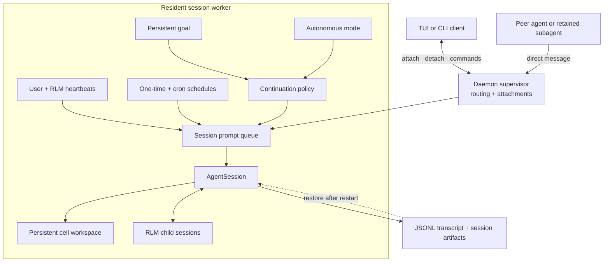

# Long-Running and Background Agents

WasmEdge Agent combines daemon-backed session workers with persistent state, scheduled prompts, direct agent messaging, goals, and bounded autonomous continuations. These features serve different purposes but share the same session and worker runtime.

## Runtime Flow



The client can detach at any point. The resident worker continues to own the queue, schedules, session, cell workspace, descendants, and persisted state.

## Daemon-Backed Sessions

Normal interactive sessions run in resident worker processes managed by a local supervisor. The worker owns the root session, its cell workspace, scheduled jobs, and RLM descendants.

Closing the terminal UI detaches the client; it does not stop the worker. List and reconnect to active agents with:

```bash
wasmedge-agent list
wasmedge-agent attach <agent>
```

Other lifecycle commands are:

```bash
wasmedge-agent agents                  # Open the agents view
wasmedge-agent rename <agent> <name>   # Give an agent a stable readable name
wasmedge-agent stop <agent>            # Stop one agent
wasmedge-agent status                  # Inspect background services
wasmedge-agent doctor [--fix]          # Diagnose or repair service state
wasmedge-agent shutdown [--force]      # Stop all agents and services
```

Workers persist transcripts as JSONL and store feature-specific state under the session artifact directory. A worker or supervisor restart can recover session state and schedules and rehydrate retained completed RLM children without treating a terminal client as the owner of the work.

Daemon workers are process-isolated for lifecycle and failure containment, not security-sandboxed. They normally run with the same operating-system permissions as the client.

## Agent-to-Agent Communication

The daemon routes direct messages between active sessions and retained daemon-backed subagents. From a shell:

```bash
wasmedge-agent send <agent> "Please verify the latest migration"
```

From a rust cell, use the `rlm::msg` module:

```rust
let roster = rlm::msg::list_agents()?;
let receipt = rlm::msg::send_to_sibling("api-reviewer", "Recheck the endpoint after the latest edit")?;
println!("{receipt}");
```

For the current parent's direct RLM children, prefer the parent-scoped registry:

```rust
let children = rlm::list_subagents()?;
let child = children.iter().find(|c| c.session_name == "api-reviewer").unwrap();
rlm::msg::send_to_child(&child.session_name, "Continue with the updated diff")?;
```

A busy target is steered and an idle target receives the message immediately; the receipt reports `delivered` when it reached an idle target's context or `queued` when accepted for later delivery. `rlm::msg::broadcast(message)` reaches only the family roster. The daemon derives sender identity and enforces message-size, rate, and pending-queue limits.

## Heartbeats and Scheduled Prompts

WasmEdge Agent has three related scheduling surfaces:

| Surface | Owner | Purpose |
|---|---|---|
| `/heartbeat` | User | One visible recurring instruction for the current session. |
| `rlm_heartbeat` | Agent | Multiple programmatically managed recurring instructions internal to the current session. |
| `wasmedge-agent schedule` | User or automation | General one-time or cron prompts targeted at an agent. |

### User heartbeat

Create and manage the current session's visible heartbeat:

```text
/heartbeat every 10m Check the deployment and report meaningful changes
/heartbeat status
/heartbeat pause
/heartbeat resume
/heartbeat clear
```

Heartbeat delivery defaults to steering active work. Add `--follow-up` when the recurring prompt should wait until the current turn finishes. Use `/heartbeats` to inspect and manage both user and agent-created heartbeats.

### Agent-created RLM heartbeats

An agent can create several internal heartbeats programmatically:

```rust
let first = rlm::heartbeat::create(
    "check whether the test run finished",
    HeartbeatOpts { interval: Some("5m".into()), label: Some("tests".into()), ..Default::default() },
)?;
rlm::heartbeat::create(
    "inspect the deployment status",
    HeartbeatOpts {
        interval: Some("10m".into()),
        label: Some("deploy".into()),
        delivery_mode: Some("follow_up".into()),
    },
)?;

rlm::heartbeat::list(false)?;
rlm::heartbeat::update(
    first["heartbeat"]["id"].as_str().unwrap(),
    HeartbeatUpdate { status: Some("paused".into()), ..Default::default() },
)?;
```

RLM heartbeats are distinct from the user's `/heartbeat`; the guest API cannot replace or clear the user-owned heartbeat.

### General schedules

Schedule a one-time or recurring prompt for an addressable agent:

```bash
wasmedge-agent schedule add worker "in 30m" -- "Check the benchmark result"
wasmedge-agent schedule add worker "0 9 * * 1-5" -- "Review open work"
wasmedge-agent schedule list --all
wasmedge-agent schedule cancel <job-id>
```

Scheduled jobs are persisted per session and continue while the UI is detached. Due ticks are claimed before delivery so a crash does not replay an uncertain prompt, and missed ticks are coalesced rather than accumulated into an unbounded backlog.

## Persistent Goals

A goal is a durable objective that the harness continues to present across turns until it is complete, paused, budget-limited, errored, or cleared. Start one explicitly from the TUI:

```text
/goal Ship the release and verify every published artifact
/goal --budget 200000 Complete the repository migration
```

Manage its state with:

```text
/goal status
/goal pause
/goal resume
/goal clear
```

The model uses the `rlm::goal` module to inspect or finish the objective:

```rust
let state = rlm::goal::get()?;
rlm::goal::complete()?;
```

Goal state records token usage, elapsed time, continuation count, and an optional explicit token budget. The harness keeps prompting an active goal after ordinary assistant turns; only `goal.complete()` marks successful completion. Creating a persistent goal is an explicit user or host action, not something the agent should infer from every task.

## Autonomous Mode

Autonomous mode is a bounded host policy for runs where no human input is expected. WasmEdge Agent adds follow-up continuations until configured quality gates pass or a continuation, turn, token, or wall-clock limit is reached.

Enable it in an interactive session:

```text
/autonomous on
/autonomous status
/autonomous off
```

Or configure a run from the CLI:

```bash
wasmedge-agent \
  --autonomous \
  --autonomous-gate "npm run check" \
  --autonomous-max-turns 20 \
  "Implement and verify the requested change"
```

Autonomous mode supports limits for continuations, assistant turns, tokens, and wall-clock duration. Gate commands run before the session may finish; a failed gate returns its bounded output to the agent for another attempt. WasmEdge Agent avoids rerunning the same failed gate when the workspace has not changed.

Goals and autonomous mode are complementary but different:

- a **goal** stores the objective and its progress state across turns;
- **autonomous mode** decides whether to inject another continuation based on evidence, gates, and limits.

## Compaction and Continuity

Automatic compaction handles context growth during long tasks. On overflow or near the configured threshold, WasmEdge Agent summarizes older messages, retains recent context, and continues. The cell workspace persists through compaction, so `rlm::state` entries, blobs, and `agent_lib` helper functions remain available.

The agent can inspect or request compaction programmatically:

```rust
rlm::compact::status()?;
rlm::compact::run(Some("Preserve the failing tests and remaining migration steps"))?;
```

Compaction is not a completion signal. It does not stop goals, autonomous continuations, heartbeats, or existing child sessions; later parent turns continue from the compacted context.

For lower-level process and recovery behavior, see [Daemon Architecture](daemon.md). For recursive child lifecycle details, see [RLM Programming Model](rlm.md) and [RLM Runtime Architecture](rlm-runtime.md).
