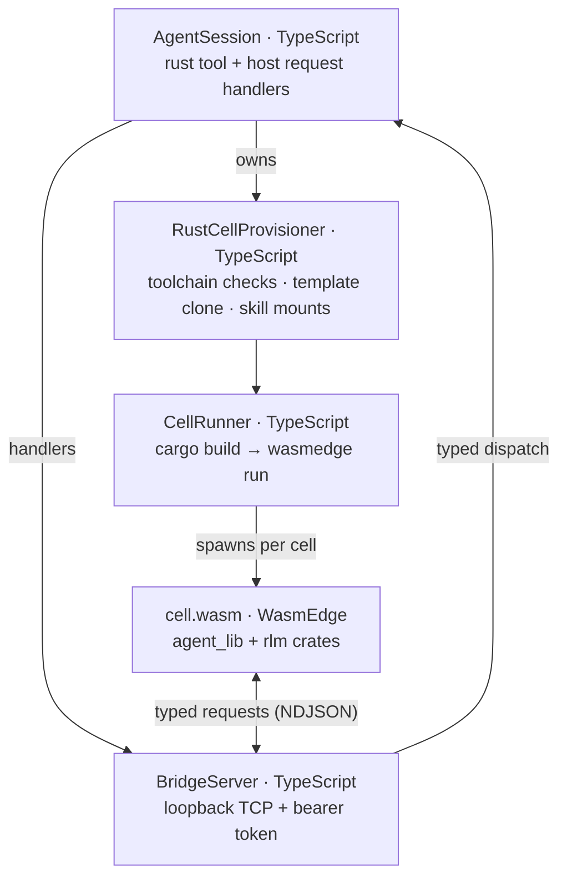
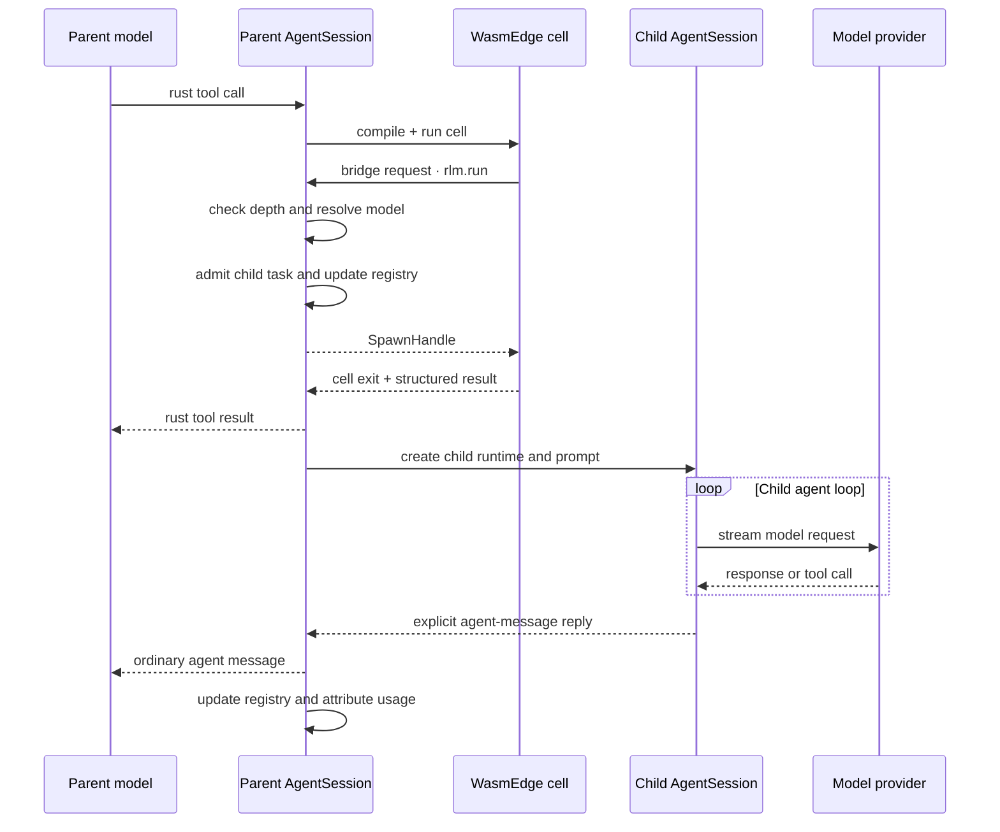

# RLM Runtime Architecture

Prime Agent gives each agent session a sandboxed Rust cell engine and a native recursive sub-agent interface. The guest `rlm` crate is a model-facing shim; the TypeScript host owns child execution, persistence, usage accounting, and lifecycle.

## Architecture



When the model delegates work:

```rust
let handle = rlm::spawn_named("inspect the API", "api-reviewer")?;
println!("{} {} {} {}", handle.rlm_child_id, handle.name, handle.session_dir, handle.model);
```

the call travels as a typed request over the cell's bridge connection. The host dispatches request type `rlm.run` to the parent `AgentSession`, which starts a child through the same TypeScript agent machinery as the parent. The call returns immediately after task admission with a child handle; it never waits for or returns the child's answer. Results arrive only through explicit agent-message replies or files.

The same bridge supports the other typed host requests: `rlm::goal`, `rlm::msg`, `rlm::compact`, `rlm::heartbeat`, `rlm::mcp`, `rlm::display`, and the generic `rlm::host_request(type, payload)` gate. State and policy remain in the TypeScript host.

## Cell Execution Pipeline

Each `rust` tool call runs one complete program:

1. Optional `lib` files are applied to `agent_lib/` (declarative extension, with backups).
2. The cell source is written to `cell/src/main.rs` and compiled with `cargo build --release --offline -p cell`. Compiles across sessions share a concurrency gate (`WASMEDGE_AGENT_MAX_CONCURRENT_BUILDS`).
3. A compile error reverts the lib changes and returns the rendered rustc diagnostics — the workspace is always left in a compilable state.
4. On success the wasm binary runs under WasmEdge with explicit preopens: the project at `/workspace` (the process working directory), persistent state at `/agent/state`, the extension crate read-only at `/agent/lib`, and the harness stores at `/agent/harness` and `/agent/harness-global`.
5. stdout/stderr, per-lib-file diffs, display attachments, and sent agent messages are composed into one structured result. Compile and run share the per-cell time budget (`rustCell.cellTimeoutMs`, default 120s).

No process lives between cells. Continuity comes from the workspace: `rlm::state` key-value entries and blobs under `/agent/state`, and functions promoted into `agent_lib`, are available to every later cell.

## Workspace Lifecycle

The guest workspace is cloned per session from a prebuilt template (`wasmedge-agent-runtime/template`): a cargo workspace holding `agent_lib` (the model-extendable prelude), `cell` (the compilation target), and `rlm` (the host-bridge shim). The template is vendored (`vendor/` + a committed crates-io redirect) and warm-built once — at install time or on first use — so clones build cells offline in seconds; on macOS the clone uses clonefile and carries the compiled `target/` for free.

Discovered Rust skills are mounted into the clone as `skills/<crate>` symlinks and re-exported through `agent_lib::skills`; a skill that fails its probe build is unmounted with a diagnostic instead of breaking cells. See [Skills](skills.md).

Toolchain resolution:

1. `WASMEDGE_AGENT_CARGO`, else `cargo` on PATH, else `~/.cargo/bin/cargo`;
2. `WASMEDGE_AGENT_WASMEDGE`, else `wasmedge` on PATH, else `~/.wasmedge/bin/wasmedge`;
3. the `wasm32-wasip1` target (prechecked via rustup when present);
4. `WASMEDGE_AGENT_TEMPLATE_DIR` overrides the template location.

`doctor` reports these checks plus template vendor/build state, and `doctor --fix` repairs what does not require installing software.

## Delegation Flow



## Component Ownership

| Component | Responsibility |
|---|---|
| `src/core/rust-cell/cell-runner.ts` | Compile pipeline, WasmEdge invocation, preopens, result composition, timeouts. |
| `src/core/rust-cell/index.ts` | Lazy provisioning: toolchain checks, template readiness, workspace clone, skill sync. |
| `src/core/rust-cell/bridge-server.ts` | Loopback bridge, bearer-token auth, framing, attachment thumbnailing, request dispatch. |
| `src/core/tools/rust.ts` | Agent tool wrapper and output shaping. |
| `src/core/agent-session.ts` | RLM policy, child creation, registry, usage attribution, cancellation, and goal handlers. |
| `wasmedge-agent-runtime/template/rlm/` | Guest shim: typed bridge clients, state, harness, spawn handles. |
| `wasmedge-agent-runtime/template/agent_lib/` | Model-extendable prelude (file helpers, `skills` re-exports). |

The guest side does not call providers or implement an agent loop.

## Bridge Transport

The bridge is a loopback TCP listener created per session and connected per cell. `CellRunner` passes `RLM_BRIDGE_ADDR`, `RLM_BRIDGE_TOKEN`, and `RLM_CELL_ID` into the cell's WASI environment; the guest authenticates with the session-scoped bearer token (the threat model of Jupyter token auth), then exchanges newline-delimited JSON frames.

Guest calls are synchronous: `rlm::spawn` blocks the cell until the admission response arrives, which keeps the model-facing API free of async ceremony. Host handlers run concurrently on the host side; a cell that exits mid-request is disconnected and its side effects end with the cell. Display frames (`rlm::display::diff`, `attach_image`) are acknowledged per frame, and oversized or invalid attachments are reported back as frame errors without dropping the connection.

Cells with no bridge (standalone `wasmedge` runs) degrade: `rlm::bridge_available()` is false and bridge calls return a host-unavailable error.

## Guest API

The `rlm` crate exports, among others:

```text
rlm::spawn(prompt) / spawn_named(prompt, name) / spawn_with(prompt, opts)
rlm::find_models(query) · rlm::list_subagents() · rlm::delete_subagent(selector)
rlm::state::{set, get, keys, remove} · blob variants
rlm::msg::{send_to_parent, send_to_child, send_to_sibling, broadcast, list_agents}
rlm::goal::* · rlm::compact::* · rlm::heartbeat::* · rlm::refine::*
rlm::harness::{local, global}
rlm::display::{diff, attach_image}
rlm::host_request(request_type, payload)
```

`SpawnHandle` contains `rlm_child_id`, `name`, `session_dir`, and `model`. It confirms admission only and never contains the child's answer.

Supported spawn options are:

- `name`: a unique readable child session name; and
- `model`: an exact `provider/model` selector from `rlm::find_models()`.

Unknown options fail instead of being ignored. Model search is bounded to active, non-expired credentials. If an exact selection is unavailable or fails auth preflight, spawn fails instead of silently falling back to another model. A child otherwise inherits the parent model.

## Child Execution

`AgentSession.runRlmChild()` performs the following sequence:

1. Check `RLM_DEPTH < RLM_MAX_DEPTH`.
2. Resolve the requested model or inherit the parent model.
3. Create a `sub-xxxxxxxx` child directory under the parent artifact directory.
4. Admit the task into the parent registry and return its `SpawnHandle`.
5. In detached work, create a child `SessionManager`, `Agent`, and `AgentSession`.
6. Reuse provider hooks, resource loader, model registry, tools, transport, retry settings, and thinking configuration.
7. Run the child prompt, retain its session, and update lifecycle state independently of the admission call.
8. Attribute child usage to the parent assistant turn and persist the attribution.

Children receive incremented `RLM_DEPTH`, the inherited maximum depth, and their own `RLM_SESSION_DIR`. A child provisions its own cell workspace from the shared template — its `rlm::state` and `agent_lib` start fresh, so context isolation extends to workspace state. The default maximum depth is 1, so root sessions may create children and those children may not create grandchildren unless the limit is configured higher.

## Independent Delegation

Each spawn call admits an independent child and returns its handle immediately:

```rust
let api = rlm::spawn_named("review the API", "api-reviewer")?;
let tests = rlm::spawn_named("review the tests", "test-reviewer")?;
let audit = rlm::spawn_named("slow independent audit", "audit-reviewer")?;
```

End the turn instead of waiting for completion. Children send requested answers with `rlm::msg::send_to_parent(...)`, and replies arrive as ordinary agent messages over later turns. A child may instead write results to files for the parent to read. The host runs each admitted child as an independent `AgentSession`; daemon-backed children can be retained as independently addressable session workers.

## Parent-Scoped Sub-Agent Registry

The TypeScript parent maintains the authoritative direct-child registry. `rlm::list_subagents()?` returns stable child IDs, active-session IDs when daemon-backed, session IDs, names, directories, and running/completed status.

This registry survives compaction and parent restore. Successfully completed daemon-backed children are rehydrated from the parent artifact registry. Inline children remain inspectable in the current process but have no active-session ID.

The parent can continue a retained daemon child with `rlm::msg::send_to_child(name, message)?`. `rlm::delete_subagent` accepts an exact child ID, active-session ID, session ID, or unique name. Deletion cancels or closes the runtime, writes a durable tombstone, and removes the child from messaging and observation. It does not erase the transcript or artifacts on disk.

Registry scope follows the parent transcript. An unrelated new parent session does not inherit children.

## Usage and Cost Attribution

The admission handle does not contain usage or completion data. Prime Agent asynchronously folds the child's assistant usage and cost into the parent assistant turn that launched it.

The parent transcript persists a `child_usage_attributed` entry containing:

- the target parent assistant message ID;
- the child usage being attributed; and
- the resulting aggregate usage.

On reload, the aggregate is reapplied to the parent message. Context-tree reporting subtracts attributed child usage when showing each node's own usage, so tree-wide own usage and root aggregate totals remain reconcilable. Child work increases billable session totals but does not inflate the parent model's context-window measurement.

## Continual Harness State

`rlm::harness` is a persisted state ledger for prompt notes, memories, reusable skill references, sub-agent specifications, and refinement events. It is not a second execution engine.

Session-local state lives in the session artifact directory under `harness/harness_state.json`, mounted into cells at `/agent/harness`; explicitly global entries live under `~/.prime/agent/harness/`, mounted at `/agent/harness-global`. Unlike the bridge-backed capabilities, harness access is direct file I/O over these preopens. The guest store re-syncs from disk when the file's mtime moves, so host-side `/refine` writes and cell writes do not overwrite each other, and saves are atomic (tmp + rename).

`/refine` runs a dedicated review over the current trajectory and applies small create/update/delete edits. Rollback uses recorded before/after snapshots. The base system prompt remains immutable; refinements are supplemental state. Skill entries reference mounted crates (`{"type": "rust", "use": "agent_lib::skills::<crate>", ...}`); kernel-era `python` references remain readable but can no longer be created.

## Goal Requests

The `rlm::goal` module is a thin host-bridge client:

```rust
rlm::goal::get()?;
rlm::goal::create("ship the release", GoalOpts { token_budget: Some(200_000) })?;
rlm::goal::complete()?;
```

Goal state, persistence, token and wall-clock accounting, and continuation prompting live in `AgentSession`. When goals are disabled, the `goal.*` host handlers are not registered and the calls fail cleanly.

## Session Artifacts

For a persisted root session, the relevant layout is:

```text
~/.prime/agent/
  sessions/
    <root-session-id>.jsonl
  session-artifacts/
    <root-session-id>/
      workspace/            # cloned cargo workspace: agent_lib, cell, state/, skills/
      scheduled-jobs.json
      harness/
        harness_state.json
      sub-xxxxxxxx/
        <child-session-id>.jsonl
        sub-yyyyyyyy/
```

Exact artifact files are created only when their features are used. Non-persistent sessions place RLM directories under the OS temporary directory and do not gain revivable session artifacts.

## Trust Boundary

Cells run as WebAssembly inside WasmEdge with only the preopened directories above: the agent's own computation is sandboxed by default, and provider credentials never enter the guest. Two honest limits: `/workspace` is writable in the default configuration, and the no-direct-network property currently rests on the crate surface rather than a runtime deny policy. The `bash` tool and the host toolchain (`cargo`, which can run build scripts) execute with the worker's OS permissions — their approval policy is the boundary for untrusted repositories. Installed skills and extensions are trusted code.

Provider credentials are resolved by the TypeScript host. The bounded model catalog crosses into the guest as metadata; the full auth store does not.

## Failure Modes

| Failure | Behavior |
|---|---|
| Toolchain missing | Provisioning fails with the doctor-style hint; `doctor --fix` repairs target/template issues. |
| Compile error | Lib changes revert; rendered rustc diagnostics return as the tool result. |
| Depth limit reached | The host rejects `rlm.run`; the guest surfaces the typed error. |
| Unsupported options | Host rejects the request. |
| Requested model unavailable | Spawn fails instead of substituting another model. |
| Cell timeout / abort | The process group is killed; queued builds abort as the same result shape. |
| Broken skill crate | Unmounted with a diagnostic; other skills and cells keep working. |
| Child cancellation | Host aborts the child and removes failed/cancelled registry entries. |
| Parent teardown | Active descendants are cancelled and their runtimes are closed. |

## Focused Validation

From `packages/coding-agent`, the implementation is covered by focused unit tests (`rust-cell-runtime`, `rust-cell-bridge-server`, `settings-manager`) and toolchain-gated integration tests (`rust-cell-bridge-integration`, `rust-cell-skills`, `rust-cell-harness`) that need `cargo`, the `wasm32-wasip1` target, and a `wasmedge` binary (`WASMEDGE_AGENT_WASMEDGE`). When changing child creation or accounting, include `agent-session-recursion.test.ts`; when changing the bridge, include the bridge server and native `rlm` tests (`cargo test --release --target <host>` in `wasmedge-agent-runtime/template/rlm`).
