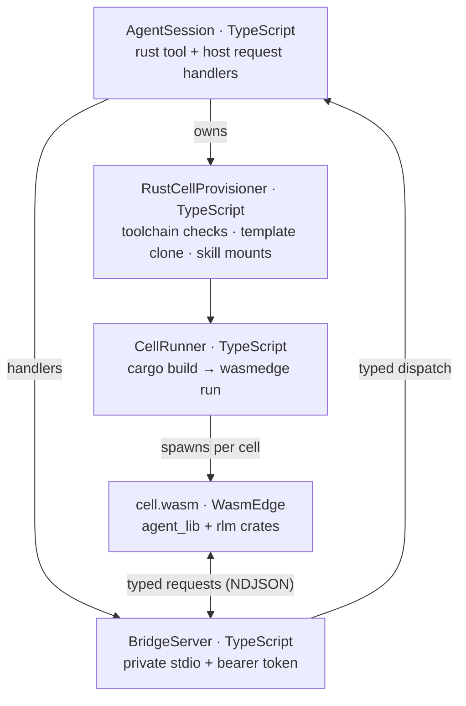
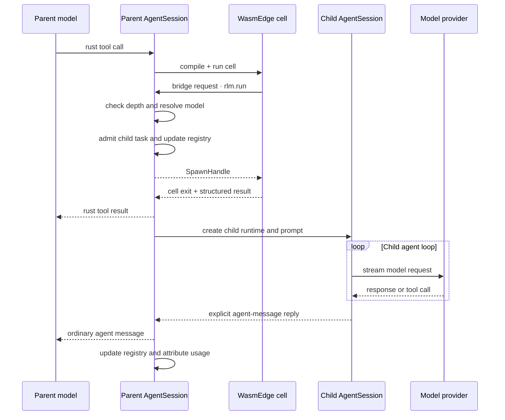

# RLM Runtime Architecture

WasmEdge Agent gives each agent session a sandboxed Rust cell engine and a native recursive sub-agent interface. The guest `rlm` crate is a model-facing shim; the TypeScript host owns child execution, persistence, usage accounting, and lifecycle.

## Architecture


```mermaid
flowchart TD
    session["AgentSession · TypeScript<br/>rust tool + host request handlers"]
    provisioner["RustCellProvisioner · TypeScript<br/>toolchain checks · template clone · skill mounts"]
    runner["CellRunner · TypeScript<br/>cargo build → wasmedge run"]
    bridge["BridgeServer · TypeScript<br/>private stdio + bearer token"]
    cell["cell.wasm · WasmEdge<br/>agent_lib + rlm crates"]

    session -->|"owns"| provisioner --> runner
    session -->|"handlers"| bridge
    runner -->|"spawns per cell"| cell
    cell <-->|"typed requests (NDJSON)"| bridge
    bridge -->|"typed dispatch"| session
```

When the model delegates work:

```rust
let handle = rlm::spawn_named("inspect the API", "api-reviewer")?;
println!("{} {} {} {}", handle.rlm_child_id, handle.name, handle.session_dir, handle.model);
```

the call travels as a typed request over the cell's bridge connection. The host dispatches request type `rlm.run` to the parent `AgentSession`, which starts a child through the same TypeScript agent machinery as the parent. The call returns immediately after task admission with a child handle; it never waits for or returns the child's answer. Results arrive only through explicit agent-message replies or files.

The same bridge supports the other typed host requests: `rlm::goal`, `rlm::msg`, `rlm::compact`, `rlm::heartbeat`, `rlm::mcp`, `rlm::display`, and the generic `rlm::host_request(type, payload)` gate. State and policy remain in the TypeScript host.

## Cell Execution Pipeline

Each `rust` tool call runs one complete program:

1. Before source edits, changed previously tested or harness-registered mounted skills must pass sandboxed tests again. Results are cached by source/dependency fingerprint within the runtime; reload/resume rechecks registered skills. Revalidation shares the cell deadline, and failure leaves the cell source and library untouched. See [Skills](skills.md#installed-skills-and-continual-harness-skills) for fingerprint scope and recovery. Optional `lib` files are then applied to `agent_lib/` (declarative extension, with backups).
2. The cell source is written to `cell/src/main.rs` and compiled with `cargo build --release --offline -p cell`. Compiles across sessions share a concurrency gate (`WASMEDGE_AGENT_MAX_CONCURRENT_BUILDS`).
3. A failed or interrupted build restores the previous cell source and lib files, including the generated helper module index. Compile errors return the rendered rustc diagnostics. Successful builds retain their source changes even if the cell later panics or times out; runtime side effects are not rolled back.
4. The host validates the compiled module and rejects imports outside a fixed set of non-network WASI Preview 1 functions, before any cell code executes. Socket/DNS, plugin, unknown, and non-function imports are rejected even if unused. Validation uses the host JavaScript engine without instantiating the module; unsupported Wasm features fail closed. WasmEdge runs the accepted module with `--force-interpreter`, preventing embedded AOT native payloads from replacing the inspected code.
5. Execution has explicit preopens: the project at `/workspace` (writable by default, read-only with `rustCell.workspaceWritePolicy: "ro"`), persistent state at `/agent/state`, the extension crate read-only at `/agent/lib`, and scratch at `/scratch`. The runner checks library readonly preopen binding with a separate inert Wasm module before the first execution; it never uses the submitted cell as a probe. Guest paths are absolute — WASI has no working directory, so cells address the project as `/workspace/...`.
6. stdout/stderr, per-lib-file diffs, display attachments, and sent agent messages are composed into one structured result. Waiting for a build permit, compilation, import inspection, the preopen probe, and execution share the per-cell time budget (`rustCell.cellTimeoutMs`, default 120s) and cancellation signal.

No process lives between cells. Continuity comes from the workspace: `rlm::state` key-value entries and blobs under `/agent/state`, and code promoted into `agent_lib`, are available to every later cell.

Optional `rustCell.cellGasLimit` and `rustCell.cellMemoryPageLimit` settings are enforced by WasmEdge's `--gas-limit` and `--memory-page-limit` flags. The same settings apply independently to each sandboxed skill test module. They default to unset; invalid values are rejected before provisioning, and unsupported runtime flags fail execution without retrying uncapped. Gas exhaustion is a runtime error, while denied linear-memory growth returns the Wasm failure value (which guest code may handle); small memory caps can also fail initialization or allocation. Memory limits apply per linear-memory instance, not to total process RSS, Cargo, host handlers, or aggregate subagent usage. See [settings](settings.md#rust-cells) for ranges and an example.

## Workspace Lifecycle

The guest workspace is cloned per session from a prebuilt template (`wasmedge-agent-runtime/template`): a cargo workspace holding `agent_lib` (the model-extendable prelude), `cell` (the compilation target), and `rlm` (the host-bridge shim). The template is vendored (`vendor/` + a committed crates-io redirect) and warm-built once — at install time or on first use — so clones build cells offline in seconds; on macOS the clone uses clonefile and carries the compiled `target/` for free.

Users can extend this dependency set with [`rustCell.preludeExtra`](settings.md#rust-cells). The host adds exact-version crates.io dependencies to the session workspace and re-exports them as `agent_lib::prelude::extra::<crate>`. Preparation vendors and release-builds in the scaffold upgrade's staging tree; dependency or compilation errors retain the original workspace. Settings contribute to workspace identity, so unchanged sessions and child snapshots reuse their prepared dependencies without fetching. This does not change the shared template. The generated `agent_lib/src/prelude_extra.rs` module is host-managed and regenerated on scaffold upgrades.

Cells can also call `rlm::deps::add("itoa")?` to enable a curated dependency for **subsequent cells**, then use `extra::itoa::Buffer::new()` after importing the prelude. The [curated catalog](../src/core/rust-cell/dependency-catalog.ts) pins 30 crates with default features, including CSV parsing, encoding, Unicode text, collections, hashing and version matching. Each crate has a representative API tested with the WasmEdge runner. Rust paths replace hyphens with underscores. Additions accept no version, feature, Git, or path arguments. Other crates require user configuration. Explicit `preludeExtra` settings take precedence for matching names.

The host first resolves against the workspace's existing vendor directory offline. Missing sources trigger host-side `cargo vendor` from crates.io in the staging workspace, before mounting skills; sources needed only by skills are retained. The current cell, library and mounted skills then release-build offline without execution. Resolution, fetching and building share the requesting cell's timeout and cancellation. Only dependency manifests, the generated prelude exports, dependency metadata and vendor sources are published; state directories and open guest files stay in place. Failed or cancelled fetches and builds retain the previous dependencies. New crates require registry access or a populated Cargo cache; already-vendored additions and unchanged resume/child snapshots work with an empty Cargo cache offline. Publication has a recovery journal for interrupted updates. Successful additions persist in `.cell-dependencies.json`, survive resume and child snapshots, and create a `chore(deps)` Git snapshot in persistent workspaces. Repeated additions are no-ops. A Git failure is reported as an already-applied addition with a failed snapshot. Additions are not rolled back if the requesting cell later fails, and there is currently no guest removal API.

Discovered Rust skills are mounted into the clone as `skills/<crate>` symlinks and re-exported through `agent_lib::skills`; a skill that fails its probe build is unmounted with a diagnostic instead of breaking cells. See [Skills](skills.md).

Persisted workspaces have their own local Git repository with an initial snapshot and a commit after each successful cell. Commits record the cell source, library and runtime sources, manifests, skill mounts, and `state/` (including blobs); messages contain a sequence number and tool-call ID. Build caches, vendored dependencies, and scratch files are excluded. External skill symlinks record the mount, not the external source contents. Project files and harness stores are outside this repository. Failed cells do not create cell snapshots; an earlier successful dependency addition keeps its own snapshot. Snapshots do not roll back runtime side effects. A Git failure after successful execution is reported separately in the tool result without rerunning the cell. Non-persistent sessions do not initialize Git.

State and blob writes stage data in an exclusively created sibling directory,
then rename the completed file into place. Existing `.tmp` files, directories,
and symlinks are not reused as staging space. Cleanup is attempted on success or
an I/O error; process termination can leave a directory that later writes skip
and inventories omit. This does not make multiple state updates
transactional or serialize concurrent read-modify-write operations.

Resume and compaction notices list public free functions and type names found
by scanning `agent_lib/src/lib.rs` and its public modules. Types include structs,
enums, unions, type aliases, and traits (including unsafe traits). Paths are
relative to `agent_lib`, including nested and inline modules. A workspace with
only public types still receives a restore notice. Listings reflect current
source files, including applied or reverted library edits.

Both notices include saved state keys and blob names, without their contents.
Compaction reads an existing workspace from disk even before the first Rust cell
after resume or runtime reload. This does not initialize the toolchain, upgrade
the workspace, or start WasmEdge. A workspace is recognized by its `Cargo.toml`;
a new session without one receives no compaction state notice.

State inventory is best-effort: missing stores are empty, while unreadable stores
or a `state.json` that is not a valid JSON object produce explicit warnings.
Resume and compaction still deliver the readable inventory, even when only
warnings remain. Restore warnings are also visible in the TUI without expanding
the notice. Blob listings match `rlm::state::list_blobs`: all regular files,
including valid names ending in `.tmp`. Symlinks and directories, including
interrupted-write staging directories, are omitted. Legacy `.tmp` files may be
leftover writes or saved blobs; both are listed because the name cannot tell
them apart. Listing does not repair, delete, or overwrite saved data.

These notices are labeled **source scan**. They do not compile the library or
report fields, variants, signatures, associated items, re-exports, or generated
API. Items with `cfg`, `cfg_attr`, or custom `path` attributes are omitted rather
than evaluated. Full rustdoc JSON introspection remains planned.

Toolchain resolution:

1. `WASMEDGE_AGENT_CARGO`, else `cargo` on PATH, else `~/.cargo/bin/cargo`;
2. `WASMEDGE_AGENT_WASMEDGE`, else `wasmedge` on PATH, else `~/.wasmedge/bin/wasmedge`;
3. the `wasm32-wasip1` target (prechecked via rustup when present);
4. `WASMEDGE_AGENT_TEMPLATE_DIR` overrides the template location.

`doctor` reports these checks plus template vendor/build state, and `doctor --fix` repairs what does not require installing software.

On provisioning, `.workspace-version` records the installed template's content and dependency hashes, Rust compiler identity, WasmEdge version, and the template defaults for `agent_lib/src`. A version mismatch stages a scaffold upgrade beside the workspace: host manifests/configuration, `rlm`, vendored dependencies, and the template build cache are refreshed; skill mounts are regenerated; then the retained cell and library are built with `cargo build --release --offline -p cell`. The template sets Cargo's intermediate build directory to its own `target` so a global Cargo configuration cannot mix staged and other workspace artifacts. The retained cell is never executed during migration. The host publishes the staged workspace only after the build passes.

Upgrades retain helpers, skill sources, state/blobs, the last cell source, unrelated files, and Git history. Unmodified library defaults follow the template; locally changed or deleted library files remain local overrides. Workspaces predating the marker retain their existing library sources conservatively because their original defaults are unknown. An incompatible library or retained cell blocks the upgrade with compiler diagnostics and leaves the original workspace intact. The next provisioning attempt can retry; an abandoned upgrade journal recovers an interrupted directory switch. Provisioning rejects a live upgrade owner and malformed version metadata. This assumes one active runtime owns a session workspace.

Upgrade staging uses the same skill compile probes as normal startup before
validating the retained cell. Unused skills rejected by the probes are unmounted
and diagnosed; if the retained cell or library still depends on one, validation
fails and the original workspace stays in place. Unmounting removes symlinks
and generated Cargo/re-export entries but preserves inherited skill source
directories, so they can be repaired and remounted on reload.

The marker travels with a child's spawn-time seed and is included in subsequent Git snapshots. A seed from an older installation goes through the same migration before its first cell. Skill manifest, source, test, and fixture changes use the separate `.skills-hash` synchronization mechanism to repeat mount probes on reload. This is a scaffold compatibility check, not a mandatory `cargo test` gate for cells.

## Delegation Flow


```mermaid
sequenceDiagram
    participant M as Parent model
    participant H as Parent AgentSession
    participant W as WasmEdge cell
    participant C as Child AgentSession
    participant P as Model provider

    M->>H: rust tool call
    H->>W: compile + run cell
    W->>H: bridge request · rlm.run
    H->>H: check depth and resolve model
    H->>H: admit child task and update registry
    H-->>W: SpawnHandle
    W-->>H: cell exit + structured result
    H-->>M: rust tool result
    H->>C: create child runtime and prompt
    loop Child agent loop
        C->>P: stream model request
        P-->>C: response or tool call
    end
    C-->>H: explicit agent-message reply
    H-->>M: ordinary agent message
    H->>H: update registry and attribute usage
```

## Component Ownership

| Component | Responsibility |
|---|---|
| `src/core/rust-cell/cell-runner.ts` | Compile pipeline, WasmEdge invocation, preopens, result composition, timeouts. |
| `src/core/rust-cell/index.ts` | Lazy provisioning: toolchain checks, template readiness, workspace clone, skill sync. |
| `src/core/rust-cell/workspace-history.ts` | Local Git snapshots after successful persisted cells. |
| `src/core/rust-cell/workspace-snapshot.ts` | Spawn-time library and cache copies with independent skill sources. |
| `src/core/rust-cell/bridge-server.ts` | Bearer-token auth, framing, attachment thumbnailing, request dispatch. |
| `src/core/rust-cell/stdio-bridge.ts` | Separate protocol frames from ordinary stdout and deliver private replies on stdin. |
| `src/core/rust-cell/wasm-imports.ts` | Validate and enforce non-network imports for cells and skill tests. |
| `src/core/refinement/harness-api.ts` | Host-owned harness CRUD, skill validation/test gate, and persistence. |
| `src/core/tools/rust.ts` | Agent tool wrapper and output shaping. |
| `src/core/agent-session.ts` | RLM policy, child creation, registry, usage attribution, cancellation, and goal handlers. |
| `wasmedge-agent-runtime/template/rlm/` | Guest shim: typed bridge clients, state, harness, spawn handles. |
| `wasmedge-agent-runtime/template/agent_lib/` | Model-extendable prelude (file helpers, `skills` re-exports). |

The guest side does not call providers or implement an agent loop.

## Bridge Transport

The bridge uses private process pipes; ordinary cells open no TCP listener or socket. `CellRunner` passes `RLM_BRIDGE_STDIO=1`, `RLM_BRIDGE_TOKEN`, and `RLM_CELL_ID` into the cell's WASI environment. The guest authenticates with the session token and active cell ID, then exchanges protocol-v1 newline-delimited JSON frames. Guest frames on stdout carry the prefix `\x1eRLM:<token>:`; the host removes those frames from visible output and writes replies only to stdin. stdin is reserved for the bridge. Ordinary stdout/stderr remain streamed, including output without a trailing newline and UTF-8 split across chunks. Frames are capped at 32 MiB.

Guest calls are synchronous: `rlm::spawn` blocks the cell until the admission response arrives. Ordinary requests have a 30-second guest deadline; skill registration tests use the cell budget. WASI polling keeps an absent reply from blocking past the guest deadline. After a transport timeout, the next call renews the handshake: the host aborts prior cooperative work and suppresses its late replies. Requests are never replayed automatically. Cell exit or cancellation also aborts cooperative host work; completed side effects are not rolled back. Display frames (`rlm::display::diff`, `attach_image`) are acknowledged per frame, and invalid attachments return frame errors without dropping the connection.

This transport preserves the stock WasmEdge CLI and existing host handlers while closing the socket-import gap. The planned T2 native runner and host-function ABI remain separate work. The native Rust protocol tests retain a TCP backend with `RLM_BRIDGE_ADDR`; WASI cells do not use it. Persisted workspaces refresh their `rlm` scaffold through the normal upgrade path.

Cells with no bridge (standalone `wasmedge` runs) degrade: `rlm::bridge_available()` is false and bridge calls return a host-unavailable error.

## Guest API

The `rlm` crate exports, among others:

```text
rlm::spawn(prompt) / spawn_named(prompt, name) / spawn_with(prompt, opts)
rlm::find_models(query) · rlm::list_subagents() · rlm::delete_subagent(selector)
rlm::state::{set, get, keys, remove} · blob variants
rlm::msg::{send_to_parent, send_to_child, send_to_sibling, broadcast, list_agents}
rlm::goal::* · rlm::compact::* · rlm::heartbeat::* · rlm::refine::*
rlm::harness::{local, global}
rlm::skills::package(name, description, instructions, source)
rlm::display::{diff, attach_image}
rlm::host_request(request_type, payload)
```

`SpawnHandle` contains `rlm_child_id`, `name`, `session_dir`, and `model`. It confirms admission only and never contains the child's answer.

Supported spawn options are:

- `name`: a unique readable child session name; and
- `model`: an exact `provider/model` selector from `rlm::find_models()`.

Unknown options fail instead of being ignored. Model search is bounded to active, non-expired credentials. If an exact selection is unavailable or fails auth preflight, spawn fails instead of silently falling back to another model. A child otherwise inherits the parent model.

## Child Execution

`AgentSession.runRlmChild()` performs the following sequence:

1. Check `RLM_DEPTH < RLM_MAX_DEPTH`.
2. Resolve the requested model or inherit the parent model.
3. Create a `sub-xxxxxxxx` child directory under the parent artifact directory and snapshot the parent's provisioned library, skills, and build cache before admission.
4. Admit the task into the parent registry and return its `SpawnHandle`.
5. In detached work, create a child `SessionManager`, `Agent`, and `AgentSession`.
6. Reuse provider hooks, resource loader, model registry, tools, transport, retry settings, and thinking configuration.
7. Run the child prompt, retain its session, and update lifecycle state independently of the admission call.
8. Attribute child usage to the parent assistant turn and persist the attribution.

Children receive incremented `RLM_DEPTH`, the inherited maximum depth, and their own `RLM_SESSION_DIR`. A child starts with the parent's `agent_lib` as it was at spawn, including helpers and copies of mounted skill sources. The snapshot also carries scaffold dependencies and the build cache; cache reuse still depends on Cargo's freshness checks. The child has a fresh cell source, empty `rlm::state`, and independent Git history. Parent and child library edits are independent. An unprovisioned parent uses its own inherited seed, if present, or the shared template. The default maximum depth is 1, so root sessions may create children and those children may not create grandchildren unless the limit is configured higher.

The frozen seed is stored under the child session directory as `.rust-workspace-seed/`, so delayed startup and daemon restoration before the first cell use the same snapshot. Existing child workspaces survive reload without being overwritten. Root skill mounts remain editable symlinks; inherited child skills are local copies and stay local on reload.

## Independent Delegation

Each spawn call admits an independent child and returns its handle immediately:

```rust
let api = rlm::spawn_named("review the API", "api-reviewer")?;
let tests = rlm::spawn_named("review the tests", "test-reviewer")?;
let audit = rlm::spawn_named("slow independent audit", "audit-reviewer")?;
```

End the turn instead of waiting for completion. Children send requested answers with `rlm::msg::send_to_parent(...)`, and replies arrive as ordinary agent messages over later turns. A child may instead write results to files for the parent to read. The host runs each admitted child as an independent `AgentSession`; daemon-backed children can be retained as independently addressable session workers.

## Parent-Scoped Sub-Agent Registry

The TypeScript parent maintains the authoritative direct-child registry. `rlm::list_subagents()?` returns stable child IDs, active-session IDs when daemon-backed, session IDs, names, directories, and running/completed status.

This registry survives compaction and parent restore. Successfully completed daemon-backed children are rehydrated from the parent artifact registry. Inline children remain inspectable in the current process but have no active-session ID.

The parent can continue a retained daemon child with `rlm::msg::send_to_child(name, message)?`. `rlm::delete_subagent` accepts an exact child ID, active-session ID, session ID, or unique name. Deletion cancels or closes the runtime, writes a durable tombstone, and removes the child from messaging and observation. It does not erase the transcript or artifacts on disk.

Registry scope follows the parent transcript. An unrelated new parent session does not inherit children.

## Usage and Cost Attribution

The admission handle does not contain usage or completion data. WasmEdge Agent asynchronously folds the child's assistant usage and cost into the parent assistant turn that launched it.

The parent transcript persists a `child_usage_attributed` entry containing:

- the target parent assistant message ID;
- the child usage being attributed; and
- the resulting aggregate usage.

On reload, the aggregate is reapplied to the parent message. Context-tree reporting subtracts attributed child usage when showing each node's own usage, so tree-wide own usage and root aggregate totals remain reconcilable. Child work increases billable session totals but does not inflate the parent model's context-window measurement.

## Continual Harness State

`rlm::harness` is a persisted state ledger for prompt notes, memories, reusable skill references, sub-agent specifications, and refinement events. It is not a second execution engine.

`rlm::skills::package` sends `skills.package` to the host to create a project-local Rust skill under the project's config directory (`.wasmedge-agent/skills/<name>/`, with the existing config-directory fallback). The host generates `SKILL.md`, `Cargo.toml` with fixed workspace dependencies, and `src/lib.rs` from the supplied source. Names must start with a lowercase letter, use lowercase letters/digits/single hyphens, and fit 64 characters; reserved crate names and collisions with loaded skills are rejected. Existing destinations and symlinked parent directories are never overwritten or followed. The response contains the guest `path`, `crate_name`, `rust_use`, and `requires_reload: true`.

Packaging only creates files; it does not compile, test, mount, or register a skill. Reload with `/reload` or start a new session for normal discovery and mounting, then register through the tested harness API below. Supply complete library source with deterministic unit tests and document public signatures in `instructions`. This API creates project-local skills only, cannot add dependencies or overwrite an existing skill, and does not change the trust boundary for host compilation. Concurrent host filesystem changes remain outside its path checks.

Session-local state lives in the session artifact directory under `harness/harness_state.json`; explicitly global entries live under `~/.wasmedge-agent/harness/`. These stores are host-owned and are not preopened into cells. All `rlm::harness` calls, including reads and non-skill edits, require a live bridge and use `harness.request`. The host selects the store from the session and scope, reloads it for each request, and saves atomically (tmp + rename). Guest API signatures and the schema remain unchanged; standalone guests without a bridge can no longer use harness CRUD. There is no cross-process transaction lock.

`/refine` runs a dedicated review over the current trajectory and applies small create/update/delete edits. Rollback uses recorded before/after snapshots. The base system prompt remains immutable; refinements are supplemental state. Skill entries reference mounted crates (`{"type": "rust", "use": "agent_lib::skills::<crate>", ...}`); kernel-era `python` references remain readable but can no longer be created.

Skill `create_skill`, `update_skill`, and `update("skill", ...)` calls require a live bridge and passing sandboxed unit/integration tests before saving, using the same test runner as `/refine`. Tests receive only disposable scratch access. The host validates the reference, runs the tests, then reloads the store before saving and rejects an update if that entry changed in the meantime. Skill test requests use the cell budget instead of the ordinary 30-second bridge timeout; cancellation, cell end, or disconnection cancels their host work. The host ignores guest-supplied test results and entry version/source fields. Non-skill edits and deletion do not require tests.

Sandboxed skill tests share the cell import allowlist and interpreter requirement above. Every test artifact is checked before any module executes. Unlike ordinary cells, tests have no bridge connection or credentials. Cargo build scripts/proc macros continue to run on the host.

Before compilation and again before execution, the runner rejects writable `/workspace`, `/agent/state`, or `/scratch` mounts that overlap either configured harness store, including symlinked mount roots, store parents, and existing state-file targets. Keep project directories separate from session/agent storage; using a home directory or a project containing its session storage as `/workspace` can now be rejected. This prevents direct guest file writes through the configured mounts. Host bash, build scripts/proc macros, host-created hard links, and concurrent host filesystem changes remain outside this boundary.

With `rustCell.workspaceWritePolicy: "ro"`, `/workspace` uses WasmEdge's `:readonly`
preopen. The runner also rejects writable state/scratch mounts overlapping the
project in either direction, resolving symlink roots and existing ancestors.
Host mount paths containing colons are rejected to avoid ambiguous CLI parsing.
These checks run before source edits/build and again before execution; there is
no fallback to a writable project. Existing harness isolation checks still apply.
Cells can read/search the project, save state, write scratch files, and submit
library edits. For project edits the prompt requests a patch, which the existing
host bash tool can apply (for example, `git apply` in the host project directory).
Without bash, the prompt asks the model to return the patch to its caller.
This adds neither a patch approval gate nor trajectory replay; host permissions
and the filesystem limitations above still apply. See [settings](settings.md#rust-cells).

## Goal Requests

The `rlm::goal` module is a thin host-bridge client:

```rust
rlm::goal::get()?;
rlm::goal::create("ship the release", GoalOpts { token_budget: Some(200_000) })?;
rlm::goal::complete()?;
```

Goal state, persistence, token and wall-clock accounting, and continuation prompting live in `AgentSession`. When goals are disabled, the `goal.*` host handlers are not registered and the calls fail cleanly.

## Session Artifacts

For a persisted root session, the relevant layout is:

```text
~/.wasmedge-agent/
  sessions/
    <root-session-id>.jsonl
  session-artifacts/
    <root-session-id>/
      workspace/            # cloned cargo workspace: agent_lib, cell, state/, skills/
      scheduled-jobs.json
      harness/
        harness_state.json
      sub-xxxxxxxx/
        <child-session-id>.jsonl
        sub-yyyyyyyy/
```

Exact artifact files are created only when their features are used. Non-persistent sessions place RLM directories under the OS temporary directory and do not gain revivable session artifacts.

## Trust Boundary

Cells run as WebAssembly inside WasmEdge with only the preopened directories above. The runner denies direct guest networking through import validation and forced interpreter execution, including for cells with a bridge; network capabilities are available only through registered host handlers. This is a policy of the agent's runner, not a network restriction added to standalone WasmEdge. `/workspace` remains writable by default. The `bash` tool, host handlers, and the host toolchain (`cargo`, including build scripts/proc macros) execute with the worker's OS permissions. Installed skills and extensions are trusted code; the guest policy does not sandbox compilation or the whole agent.

Provider credentials are resolved by the TypeScript host. The bounded model catalog crosses into the guest as metadata; the full auth store does not.

Runtime-managed Cargo processes receive an environment allowlist, including template preparation, workspace upgrades, cell builds, skill probes/tests, and dependency resolution/vendoring. Rust compiler and rustup probes/repairs use the same policy. Inherited variables are limited to `PATH`, `HOME`, `USERPROFILE`, `SystemRoot`, `WINDIR`, `ComSpec`, `PATHEXT`, `TEMP`, `TMP`, `TMPDIR`, `SDKROOT`, `MACOSX_DEPLOYMENT_TARGET`, `CARGO_HOME`, `CARGO_NET_OFFLINE`, `RUSTUP_HOME`, `RUSTUP_TOOLCHAIN`, `RUSTUP_AUTO_INSTALL`, and `RUSTC` (case-insensitive on Windows). Skill test builds additionally receive host-selected target/build directories. Provider variables, registry tokens, proxy settings, compiler flags/wrappers, and other ambient variables are not inherited; setups that relied on those variables must account for this change. The host's own environment is unchanged.

This prevents unlisted parent environment values from reaching compilation through ordinary inheritance. It does not isolate compiler filesystem access: `include_str!`, build scripts, and proc macros still have host permissions, and Cargo configuration files can supply environment values or credentials. Existing artifacts are not scrubbed. Do not treat this policy as a guarantee that model-generated code cannot obtain provider credentials.

## Failure Modes

| Failure | Behavior |
|---|---|
| Toolchain missing | Provisioning fails with the doctor-style hint; `doctor --fix` repairs target/template issues. |
| Compile error | Lib changes revert; rendered rustc diagnostics return as the tool result. |
| Invalid module / disallowed import | Cell does not execute; the tool reports the policy error. Successfully compiled source changes remain. |
| Depth limit reached | The host rejects `rlm.run`; the guest surfaces the typed error. |
| Unsupported options | Host rejects the request. |
| Requested model unavailable | Spawn fails instead of substituting another model. |
| Cell timeout / abort | The process group is killed; queued builds abort as the same result shape. |
| Broken skill crate | Unmounted with a diagnostic; other skills and cells keep working. |
| Child cancellation | Host aborts the child and removes failed/cancelled registry entries. |
| Parent teardown | Active descendants are cancelled and their runtimes are closed. |

## Focused Validation

From `packages/coding-agent`, the implementation is covered by focused unit tests (`rust-cell-runtime`, `rust-cell-bridge-server`, `settings-manager`) and toolchain-gated integration tests (`rust-cell-bridge-integration`, `rust-cell-skills`, `rust-cell-harness`) that need `cargo`, the `wasm32-wasip1` target, and a `wasmedge` binary (`WASMEDGE_AGENT_WASMEDGE`). When changing child creation or accounting, include `agent-session-recursion.test.ts`; when changing the bridge, include the bridge server and native `rlm` tests (`cargo test --release --target <host>` in `wasmedge-agent-runtime/template/rlm`).
