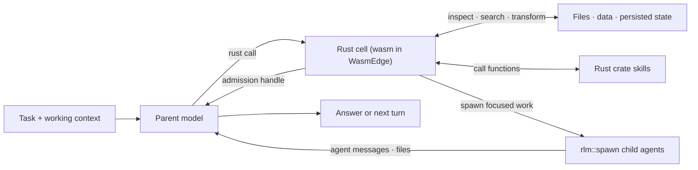

# RLM Programming Model

Prime Agent is built around a recursive language model (RLM) runtime: the model works by writing Rust programs — cells — that are compiled to WebAssembly and executed in a WasmEdge sandbox. Provider calls, session persistence, child lifecycles, scheduling, and safety policy remain in the TypeScript host; the Rust cell is the model-facing programming surface.

## RLM Loop



The parent keeps its own context focused while cell state holds working data and child agents receive only the context needed for their subtasks.

## Core Invariants

### 1. Execution is programmatic

The default RLM runtime exposes two built-in model tools: `rust` and `bash`. Reading and editing files, transforming results, invoking skills, and delegating work all begin from a Rust cell; `bash` remains for a project's own commands (builds, tests, package managers), which need the real host environment.

Each cell is a complete program — it compiles, runs to completion inside the sandbox, and exits. No process lives between cells, so continuity comes from the persistent workspace instead: values saved with `rlm::state` (and blobs for big payloads) survive across cells and compaction, and functions promoted into `agent_lib` become part of every later cell.

```rust
use agent_lib::prelude::*;

fn main() -> Result<()> {
    let large: Vec<String> = walk(".")?
        .into_iter()
        .filter(|p| p.extension().is_some_and(|e| e == "toml"))
        .filter(|p| std::fs::metadata(p).map(|m| m.len() > 10_000).unwrap_or(false))
        .map(|p| p.display().to_string())
        .collect();
    rlm::state::set("large_configs", &large)?;
    println!("{} large config files", large.len());
    Ok(())
}
```

A later cell reads `rlm::state::get("large_configs")?` — or checks `rlm::state::keys()?` — instead of re-deriving the list. Prime Agent extensions may intentionally add custom tools, but the built-in RLM design does not require a separate model tool for every capability.

### 2. Subagents are native RLM calls

The `rlm` crate is preloaded in every cell. Spawn a child with a direct call:

```rust
let handle = rlm::spawn_named("Review the authentication flow for security issues", "auth-reviewer")?;
println!("{} {} {} {}", handle.rlm_child_id, handle.name, handle.session_dir, handle.model);
```

The call returns immediately after task admission with a child handle; it never waits for or returns the child's answer. The TypeScript host creates a normal child `AgentSession` with an independent context and session directory. The child inherits the parent model, provider configuration, skills, tools, retry policy, and resource loader unless `rlm::spawn_with` requests another configured model.

Spawn independent children in one cell and end the turn instead of awaiting completion:

```rust
let api = rlm::spawn_named("Review the public API", "api-reviewer")?;
let tests = rlm::spawn_named("Review the test coverage", "test-reviewer")?;
let audit = rlm::spawn_named("Run the slow integration audit", "integration-audit")?;
```

Results arrive only through explicit agent messages or files, never as a `spawn` return value. Children reply when an answer is needed:

```rust
rlm::msg::send_to_parent("Audit complete: two findings, details in findings.md")?;
```

The parent can follow up with a retained child:

```rust
rlm::msg::send_to_child("api-reviewer", "Check the newly added regression test.")?;
```

#### Child handles and lifecycle

An admission handle contains `rlm_child_id`, `name`, `session_dir`, and `model`. Child usage is attributed to the parent session while remaining distinguishable in context-tree reporting.

The parent-scoped child registry survives compaction and parent restoration:

```rust
for child in rlm::list_subagents()? {
    println!("{} {} {:?}", child.session_name, child.status, child.active_session_id);
}
```

Successfully completed daemon-backed children remain addressable while their parent session is open. Delete a child only when its context is no longer needed. The default recursion depth allows a root agent to create children; raising the configured depth allows descendants to recurse further.

### 3. Skills add programmatic capability

Prime Agent supports the Agent Skills markdown format and extends it with Rust crate skills. Both use `SKILL.md` for discovery, routing, and instructions. A Rust skill also contains a crate that Prime Agent mounts into the cell workspace and exposes under `agent_lib::skills`.

For a skill named `release-audit`, the model can call:

```rust
let report = agent_lib::skills::release_audit::run(".", "0.4.0")?;
```

This makes Rust skills a superset of instruction-only skills: they can provide guidance, references, typed callables, and optional shell commands. They may also call `rlm::spawn(...)` themselves when a capability needs recursive delegation.

Only skill metadata is placed in the startup prompt. The agent loads the full `SKILL.md` when the task matches, then calls the documented Rust API. See [Skills](skills.md) for discovery, packaging, and the built-in skill-creation workflow.

### 4. State is designed to outlive one turn

The RLM programming model assumes useful work may take many turns or continue after the terminal UI closes:

- automatic compaction summarizes older context while preserving recent messages, and the workspace (`rlm::state`, blobs, `agent_lib`) carries data across the boundary;
- daemon-backed workers keep active sessions running after clients detach;
- child registries and session artifacts make subagents recoverable;
- heartbeats and scheduled prompts re-enter a session later;
- persistent goals continue until the objective is complete or the user changes their state; and
- autonomous mode adds bounded continuations and optional quality gates.

See [Long-Running and Background Agents](long-running-agents.md) for these lifecycle features.

## Host Bridge

Cells reach host-owned capabilities through typed requests over a per-cell bridge connection. The `rlm::goal`, `rlm::msg`, `rlm::heartbeat`, `rlm::compact`, and `rlm::mcp` modules are typed wrappers; `rlm::host_request(type, payload)` is the generic gate (for example `rlm::host_request("websearch.run", json!({"query": q}))?`). The TypeScript host validates each request and owns the state transition.

This keeps credentials, provider execution, transcript writes, worker routing, and scheduling out of the guest while retaining a programmatic model interface. It is also the product principle for outward I/O: guest code never talks to the network directly — every fetch/search-style capability is a host handler, which keeps runs replayable and credentials out of the sandbox.

## Trust Model

Rust cells run as WebAssembly inside WasmEdge with explicit preopened directories (the project at `/workspace`, the agent workspace at `/agent/*`): the agent's own computation is sandboxed by default. Two honest caveats: `/workspace` is read-write in the default configuration, and the no-direct-network property is enforced today by the crate surface (wasip1 sockets are not exposed through our prelude) rather than by a runtime deny policy. The `bash` tool is the deliberate, visible escape hatch that runs with the worker's operating-system permissions — treat its approval policy, not the cell sandbox, as the security boundary for untrusted repositories and instructions.

For implementation details, see [RLM Runtime Architecture](rlm-runtime.md).
